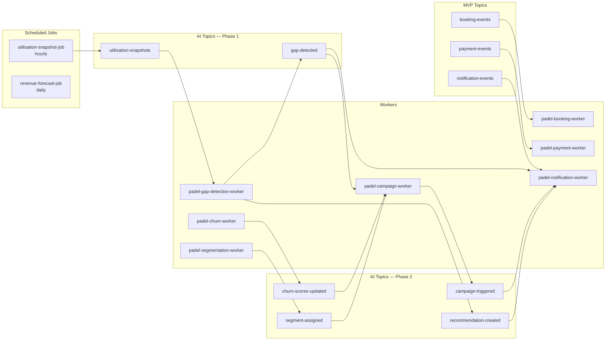

_Last updated: 2026-04-28 00:00 UTC_

# SmashBook — Analytics & AI Design

> **Audience:** Engineering (current and future contributors), technical investors/partners
> **Status:** Design document. Sprint 1–6 (MVP) is in flight; AI phases (Sprints 7+) build on this design.
> **Relationship to other docs:** This document is the design authority for everything reporting, analytics, and AI on SmashBook. [`ARCHITECTURE.md`](ARCHITECTURE.md) gives the high-level architecture and links here for detail. [`DATA_MODEL_TARGET_STATE.md`](DATA_MODEL_TARGET_STATE.md) is the schema authority — column-level definitions for every table referenced here live there.

---

## Table of Contents

1. [Purpose & Scope](#1-purpose--scope)
2. [Design Principles](#2-design-principles)
3. [User Stories Covered](#3-user-stories-covered)
4. [Read-Path Architecture: Four Tiers](#4-read-path-architecture-four-tiers)
5. [Tier 1 — Live OLTP Queries (MVP)](#5-tier-1--live-oltp-queries-mvp)
6. [Tier 2 — Pre-Computed Snapshots](#6-tier-2--pre-computed-snapshots)
7. [Tier 3 — Materialized Views](#7-tier-3--materialized-views)
8. [Tier 4 — BigQuery (Long-Term Cross-Tenant Analytics)](#8-tier-4--bigquery-long-term-cross-tenant-analytics)
9. [AI Inference Architecture](#9-ai-inference-architecture)
10. [`ai_inference_log` Partitioning](#10-ai_inference_log-partitioning)
11. [AI Feature Catalogue](#11-ai-feature-catalogue)
12. [Sync vs Async Decision Tree](#12-sync-vs-async-decision-tree)
13. [Pub/Sub Topology for Analytics & AI](#13-pubsub-topology-for-analytics--ai)
14. [Service Layer](#14-service-layer)
15. [Workers & Scheduled Jobs](#15-workers--scheduled-jobs)
16. [Reporting & Export Surface (MVP Analytics)](#16-reporting--export-surface-mvp-analytics)
17. [AI Insights Dashboard](#17-ai-insights-dashboard)
18. [pgvector & RAG](#18-pgvector--rag)
19. [Cost & Capacity Planning](#19-cost--capacity-planning)
20. [Evaluation, Monitoring & Drift](#20-evaluation-monitoring--drift)
21. [Privacy, Multi-Tenancy & PII](#21-privacy-multi-tenancy--pii)
22. [Roadmap & Phasing](#22-roadmap--phasing)
23. [Open Questions](#23-open-questions)

---

## 1. Purpose & Scope

This document is the design authority for two adjacent concerns on SmashBook:

- **Analytics** — every read path that aggregates, summarises, exports, or visualises operational data. Spans the staff "Analytics" reports in MVP through the manager AI insights dashboard and eventually cross-tenant platform analytics.
- **AI** — every feature that uses a machine-learning model (Vertex AI), a generative model (Anthropic Claude API), or a hybrid pipeline. Spans dynamic pricing through conversational booking and CV court analysis.

The two are deliberately treated together because they share the same underlying read-path infrastructure. Dashboards, forecasts, and AI feature inputs all consume the same pre-computed tables, materialized views, and (later) BigQuery data. Splitting them across documents would duplicate the design.

**Out of scope:** OLTP write paths (booking creation, payment capture, etc.) — these are covered by the per-domain service design and `DATA_MODEL_TARGET_STATE.md`. Frontend rendering of dashboards is covered in `FE_ARCHITECTURE.md` and the dashboard-specific frontend docs.

---

## 2. Design Principles

Every decision in this document follows from one of these principles. They are listed in priority order — when two conflict, the higher one wins.

**1. Tenant isolation is non-negotiable.** Every query, every materialized view, every AI inference, every BigQuery table is scoped by `club_id`. There is no exception, including for cross-tenant analytics: cross-tenant work either runs on a separate, sanitised dataset or is restricted to platform staff. Service-layer enforcement applies the same way it does on the OLTP path.

**2. Read paths scale with tenant count, not with conviction.** A query that works at one tenant must keep working at fifty. The four-tier read architecture in section 4 exists precisely to move queries off the hot path before they degrade. Tier escalation is driven by measured pain, not anticipated pain — premature materialization is its own cost.

**3. AI-native from day one.** Every AI output is logged before it is used. Every AI feature has a non-AI fallback. Every AI call is gated by a per-tenant feature flag. These are schema-level commitments encoded in `ai_inference_log`, the `fallback_used` column, and `ai_feature_flags`.

**4. Append-only for anything historical.** `court_utilisation_snapshots`, `player_engagement_scores`, `ai_inference_log`, `skill_level_history`, `match_results`, `gap_detection_events` are all insert-only. Historical scores are needed for model evaluation and drift detection — never upsert.

**5. Async by default.** Only dynamic pricing blocks the request path. Every other AI call goes through Pub/Sub. This decouples AI pipeline failures from the booking flow and keeps API latency predictable.

**6. Sources of truth are PostgreSQL until measurement says otherwise.** BigQuery, separate analytics databases, and other infrastructure are added when PostgreSQL demonstrably can't handle the load. Until then, the simpler stack wins.

---

## 3. User Stories Covered

Every user story in this section has been pulled from `issues.json` and mapped to a design element. The design must cover all of them — gaps in the design are gaps in the product.

### MVP analytics (Phase 1 / MVP Go-Live milestone)

| Issue | Story | Design home |
|---|---|---|
| #56 | Staff: generate utilisation reports by court and time period | §16 — served from Tier 1 in MVP, escalates to `court_utilisation_snapshots` (Tier 2) at Sprint 7 |
| #57 | Staff: view player retention and booking frequency data | §16 — Tier 1 in MVP; player frequency materialized view at ~10 tenants |
| #58 | Staff: export booking and payment data | §16 — synchronous CSV export endpoint backed by Tier 1 query with row cap |
| #59 | Staff: view corporate / tournament booking revenue report | §16 — Tier 1 query filtered by `booking_type` |
| #60 | Staff: view revenue breakdown by booking type and court | §16 — Tier 1 query, candidate for `mv_revenue_by_court_month` materialized view |
| #61 | Staff: view and reconcile Stripe payout records against bank deposits | §16 — payouts reconciliation report; depends on `stripe_payout_id` (#179) |
| #62 | Staff: view full transaction log with filters | §16 — paginated Tier 1 query against `payments` |
| #63 | Staff: export full financial report for a selected period | §16 — async export job for ranges >90 days |
| #69 | Staff: view log of skill level changes per player | §16 — Tier 1 query against `skill_level_history` |
| #39 | Staff: view daily revenue summary and transaction log | §16 — daily roll-up backed by `mv_daily_revenue_by_club` |
| #186 | Reconciliation report | §16 — payouts reconciliation surface |
| #98 | Player: view skill progression over time on personal dashboard | §16 — Tier 1 query against `skill_level_history`, scoped to `user_id` |

### AI Phase 1 — Sprint 7

| Issue | Story | Design home |
|---|---|---|
| #71 | Dynamic AI court pricing | §11, §12 — synchronous Vertex AI call with `pricing_rules` fallback |
| #74 | Dynamic pricing runs automatically — no manual changes | §11 — same as #71, framed as outcome |
| #75 | Revenue forecasting with weekly/monthly projections | §11, §17 — daily Cloud Run job, writes `ai_recommendations` of type `revenue_forecast` |
| #77 | Alert staff to failed/anomalous payments via AI fraud detection | §11 — `payment-events` consumer, writes `payments.anomaly_flagged` and `ai_recommendations` |
| #73 | Anomaly detection for unusual revenue patterns | §11 — daily Vertex AI scoring against `mv_daily_revenue_by_club` |
| #78 | Failed payments auto-flagged and retried | §11 — overlaps with #77; payment retry logic in payment service, anomaly scoring layered on top |

### AI Phase 1 — Sprint 8

| Issue | Story | Design home |
|---|---|---|
| #79 | AI identifies underbooked slots, generates discount offers | §11 — `gap_detection_events` pipeline |
| #82 | Staff: AI smart push notifications to fill a specific gap | §11, §13 — campaign worker consumes `gap-detected` |
| #83 | Player: AI slot suggestions matching typical patterns | §11 — uses `player_profiles` and `court_utilisation_snapshots` |
| #81 | Player: personalised discount offers for off-peak slots | §11 — same pipeline as #79 |
| #84 | Player: weather-aware alert for outdoor bookings | §11 — Anthropic API + weather API in scheduled worker |
| #76 | AI insights dashboard: NL summaries and action prompts | §17 — Anthropic-generated summary endpoint reading materialized views |

### AI Phase 2 — Sprints 9–10

| Issue | Story | Design home |
|---|---|---|
| #94 | App auto-builds skill and preference profile | §11 — `player_profiles` + nightly embedding job |
| #97 | Skill rating auto-updated after each match (ELO/TrueSkill) | §11 — `match_results` consumer |
| #92 | Player matched with partner by skill and availability | §11, §18 — pgvector similarity on `player_profiles.embedding` |
| #96 | App predicts cancellation likelihood, prompts confirm/release | §11 — `cancellation_predictions`, scored T-24h |
| #99 | Auto-flag players at risk of churning | §11 — daily churn scoring, writes `player_engagement_scores` |
| #100 | AI-drafted re-engagement messages for at-risk segments | §11 — Anthropic API in campaign worker |
| #101 | Re-engagement campaigns sent automatically to at-risk players | §11, §13 — `churn-scores-updated` triggers campaign worker |
| #102 | Players auto-segmented (casual / competitive / corporate) | §11 — segmentation worker, `player_segment_memberships` |
| #103 | Ops lead: AI staffing recommendations | §11 — recommendations engine, reads utilisation + staff schedules |
| #72 | AI recommendations: which segments to target | §11 — segmentation + recommendation engine |
| #104 | Predict equipment replacement from usage/rental history | §11 — `equipment_replacement_predictions` |
| #105 | AI triggers purchase orders when stock depletion predicted | §11 — `equipment_replacement_predictions` actioned via `ai_recommendations` |
| #107 | AI maintenance scheduling | §11 — recommendations engine reading `court_utilisation_snapshots` |
| #86 | Player: optimal membership tier suggestion | §11 — wallet-event-driven recommendation |

### AI Phase 3 — Sprints 11–12

| Issue | Story | Design home |
|---|---|---|
| #109 | Player: natural language booking | §11, §18 — Anthropic tool use, RAG over player history |
| #110 | Player: AI assistant handles rescheduling/refund/FAQ | §11 — Anthropic tool use |
| #111 | Staff: AI auto-triages player support queries | §11 — Anthropic API in support service |
| #112 | Club owner: AI chatbot handles routine player queries 24/7 | §11 — outcome of #110/#111 combined |
| #113 | Player: AI training recommendations from match data | §11 — Vertex AI + Anthropic, writes `training_recommendations` |
| #114 | Player: post-match video analysis from court cameras | §11 — Vertex AI Vision, writes `video_analyses` |
| #115 | Staff: competitor pricing intelligence in dashboard | §11 — `competitor_price_snapshots` + recommendation engine |
| #89 | Auto-generated invoices, receipts, financial reports | §17 — Anthropic-formatted reports |
| #108 | Payment disputes/chargebacks auto-flagged for human review | §11 — extends payment anomaly detection (#77) |
| #106 | Equipment damage reported in-app, costs logged automatically | §11 — extends recommendation engine to actuation |

Every issue has a home. Any new analytics or AI story needs a row added to this table before implementation begins.

---

## 4. Read-Path Architecture: Four Tiers

The platform serves four distinct kinds of read traffic. Each tier exists because the previous one stops scaling at a specific signal.

```
                Tier 1                Tier 2                 Tier 3                Tier 4
              Live OLTP            Pre-computed         Materialized            BigQuery
              queries              snapshots            views                   (cross-tenant)
                  │                     │                    │                       │
                  ▼                     ▼                    ▼                       ▼
            transactional         appended hourly     refreshed nightly      streamed via Pub/Sub
            row-by-row reads      by scheduler        from OLTP              billed per scan
                  │                     │                    │                       │
                  │                     │                    │                       │
            from MVP onward       Sprint 7 onward      ~10 tenants threshold   high tenant count
            small dashboards      AI feature inputs    historical aggregates   cross-tenant analytics
            paginated lists       gap detection,       monthly revenue,        platform optimisation
            exports               dynamic pricing      utilisation reports     investor metrics
```

The four tiers map to four different pain points:

| Tier | Solves | Triggered by |
|---|---|---|
| 1. Live OLTP | Anything ad hoc; smallest possible footprint | Default for every read |
| 2. Pre-computed snapshots | Repeated aggregation across the same date range; AI feature inputs | Need to aggregate the same window many times |
| 3. Materialized views | Dashboard load times degrading on historical aggregates | Dashboard p95 latency >1s on a stable query |
| 4. BigQuery | Cross-tenant queries that touch every tenant simultaneously | Platform-wide analytics or investor reporting |

A query never lives in two tiers at once. Escalation moves it from one to the next, and the lower-tier path is removed (or kept as fallback only with a clear sunset).

---

## 5. Tier 1 — Live OLTP Queries (MVP)

This is where every read starts. The MVP analytics surface (issues #56–#69) is implemented entirely in Tier 1.

**Pattern.** SQLAlchemy query against the live OLTP tables, tenant-scoped via the service layer, returned through a paginated FastAPI endpoint. Date-range filters mandatory on every endpoint that aggregates. Row caps on every endpoint that exports.

**When to keep a query in Tier 1:**

- Tenant count is below ~10
- Query touches only one tenant's data
- Dashboard p95 latency is below 500ms on a representative dataset
- Date range is bounded (last 30 days, last quarter)

**When to escalate:**

- Reporting queries against `bookings` or `payments` start exceeding 1s p95
- AI features need the same aggregate every hour (gap detection needs utilisation by hour) → escalate to Tier 2
- Dashboard widgets call the same query on every page load → escalate to Tier 3 (materialized view)

**Indexes that cover Tier 1.** The MVP report endpoints all benefit from `(club_id, created_at DESC)` and `(club_id, status, created_at DESC)` composite indexes on `bookings` and `payments`. These are added with the migrations that introduce the affected columns; new indexes go in `DATA_MODEL_TARGET_STATE.md` section 26 as they are identified.

**Export jobs.** Issues #58 (export bookings/payments) and #63 (export financial report) are executed through Tier 1 with one constraint: the synchronous endpoint caps at a configurable row count (target 50,000). Larger ranges return a 202 with a job ID, and a Cloud Run job writes the CSV to Cloud Storage and emails a signed URL. Async export logic lives in `report_service.py`.

---

## 6. Tier 2 — Pre-Computed Snapshots

A scheduled worker pre-computes a time-bucketed answer and writes it to a small, focused table. Reads then become a lookup, not an aggregation.

### `court_utilisation_snapshots` — required before Sprint 7

This table is the single most important pre-computed table on the platform.

**The problem it solves.** Without it, any report showing court utilisation by hour requires a full scan of `bookings` for the relevant date range, joined to `courts`, then grouped and aggregated. At 50 bookings/day across 10 clubs over 12 months, that's roughly 180,000 rows per scan — and it compounds on every dashboard load.

`court_utilisation_snapshots` inverts this. A scheduled worker pre-computes the answer hourly: "Court 3, Tuesday 6pm–7pm, 2 slots booked out of 2 available, 100% utilised." That row is written once and read many times. Reporting becomes a simple lookup against a small, tightly indexed table.

**Schema reference.** Defined in `DATA_MODEL_TARGET_STATE.md` §20. Key columns: `club_id`, `court_id`, `snapshot_date`, `hour_of_day`, `total_slots`, `booked_slots`, `utilisation_pct`, `revenue_actual`, `revenue_potential`, `avg_booking_lead_time_h`. Unique constraint on `(court_id, snapshot_date, hour_of_day)`.

**Why before Sprint 7 specifically.** Dynamic pricing (Sprint 7) and gap detection (Sprint 8) both depend on `court_utilisation_snapshots` as their primary input. If the table doesn't exist when those sprints begin, the AI features have no data to work from. The scheduled worker also needs time to accumulate history — weeks of snapshots are needed before a pricing model has enough signal to be meaningful. **Migration group G8 in `DATA_MODEL_TARGET_STATE.md` should be implemented at the start of Sprint 7, not Sprint 8, so the snapshot data is accumulating before the first AI feature consumes it.**

**Worker.** `utilisation-snapshot-job` — Cloud Run Job, hourly, triggered by Cloud Scheduler. Reads from `bookings`, `courts`, `pricing_rules`. Writes to `court_utilisation_snapshots`. Publishes to the `utilisation-snapshots` Pub/Sub topic on completion. Self-contained: failures retry with backoff but never block the API.

### Other Tier 2 tables

| Table | Granularity | Worker | Sprint |
|---|---|---|---|
| `court_utilisation_snapshots` | Per court per hour | `utilisation-snapshot-job`, hourly | G8 (pull forward to Sprint 7) |
| `player_engagement_scores` | Per player per day | `padel-churn-worker`, daily | G9 |
| `gap_detection_events` | Event-driven | `padel-gap-detection-worker` (consumes utilisation snapshots) | G8 |
| `cancellation_predictions` | Per booking, scored T-24h | scheduled job | G9 |

These tables are append-only. Stale rows are pruned through a separate retention job (initial policy: retain 24 months in PostgreSQL, archive to Cloud Storage thereafter; revisit when storage cost matters).

---

## 7. Tier 3 — Materialized Views

A regular view re-runs its full scan on every query. A materialized view runs the query once, stores the result as a real table, and serves reads from that snapshot — refreshes are explicit.

**When to add one.** When a dashboard query is hitting Tier 1 every page load and starting to degrade. The threshold in practice has been roughly 10 tenants; below that, unoptimised queries are fast enough that the maintenance overhead isn't justified.

**Example — monthly revenue by club.**

```sql
CREATE MATERIALIZED VIEW mv_monthly_revenue_by_club AS
SELECT
    club_id,
    DATE_TRUNC('month', created_at) AS month,
    SUM(amount)                     AS total_revenue,
    COUNT(*)                        AS payment_count
FROM payments
WHERE state = 'succeeded'
GROUP BY club_id, DATE_TRUNC('month', created_at);
```

A nightly job runs `REFRESH MATERIALIZED VIEW mv_monthly_revenue_by_club`. The dashboard query then hits this tiny table (one row per club per month) instead of scanning all of `payments`.

**The trade-off.**

| Use case | Approach |
|---|---|
| Historical aggregates (revenue summaries, monthly reports) | Materialized view — staleness up to 24h is acceptable |
| Live operational data (bookings today, real-time availability) | Live tables — staleness is not acceptable |

### Planned materialized views

| View | Source | Refresh | Story |
|---|---|---|---|
| `mv_daily_revenue_by_club` | `payments` | Hourly | #39, #60 |
| `mv_monthly_revenue_by_club` | `payments` | Nightly | #60, #75 (revenue forecasting input) |
| `mv_player_frequency_by_club` | `bookings` | Nightly | #57 |
| `mv_court_utilisation_monthly` | `court_utilisation_snapshots` | Nightly | #56 (post-Sprint 7) |
| `mv_payout_reconciliation` | `payments`, `platform_fees` | Hourly | #61, #186 |

Materialized views are managed through Alembic. The `CREATE MATERIALIZED VIEW` and `REFRESH` statements live in dedicated migration files; the refresh schedule is owned by Cloud Scheduler triggering a Cloud Run Job, not by `pg_cron`.

**Concurrent refreshes.** Use `REFRESH MATERIALIZED VIEW CONCURRENTLY` once a unique index is established on the view. This avoids locking readers during refresh — necessary for views that back live dashboards.

---

## 8. Tier 4 — BigQuery (Long-Term Cross-Tenant Analytics)

PostgreSQL handles "give me Club A's revenue for last month" well. It handles "across all 50 clubs, which hour of the week has the highest average court utilisation platform-wide?" poorly — that query must touch every tenant's data simultaneously across large tables. BigQuery's columnar, massively parallel architecture is built for exactly this query shape: analytical, cross-tenant, historical.

### How the existing Pub/Sub architecture connects

Every significant event already publishes to Pub/Sub — bookings, payments, notifications. BigQuery has a native Pub/Sub subscription connector. Adding a BigQuery subscription to existing topics streams events directly into BigQuery tables in near-real-time, with no changes to application code. The `booking-events` and `payment-events` topics are already the right shape for this — no new application code needed for the initial export.

```
booking-events ───┐
                  ├──→ BigQuery subscription ──→ bq.fact_bookings
payment-events ───┤
                  ├──→ BigQuery subscription ──→ bq.fact_payments
notification-events ─┐
                     └──→ bq.fact_notifications
```

### Why this is long-term

BigQuery is a separate GCP service with its own cost model (billed per query against data scanned), a new schema to maintain, and additional Terraform infrastructure. The operational complexity isn't justified until cross-tenant platform analytics are a genuine need — likely when selling to investors or optimising platform-wide pricing strategy. Until then, PostgreSQL materialized views cover the gap at significantly lower cost and complexity.

### When to introduce BigQuery

The triggers, in priority order:

1. **Investor reporting need** — pitching to investors with platform-wide metrics that PostgreSQL queries take >5s to compute.
2. **Cross-tenant ML training data** — Vertex AI training jobs need a unified, normalised dataset across tenants. (Note: this requires PII handling — see §21.)
3. **Tenant count crosses ~30** and platform-wide queries are starting to run unacceptably slow against PostgreSQL even with materialized views.

### Initial scope when introduced

- One BigQuery dataset per environment (`smashbook_staging`, `smashbook_production`).
- Three fact tables (`fact_bookings`, `fact_payments`, `fact_notifications`) sourced from existing Pub/Sub topics.
- One dimension table per slowly-changing entity (`dim_clubs`, `dim_courts`, `dim_users`) refreshed nightly via Cloud Run Job that reads from PostgreSQL.
- Access restricted to platform staff via IAM. **No tenant-facing query path against BigQuery.** Tenant dashboards continue to read PostgreSQL.

The BigQuery dataset is **not** a sanctioned source of truth for tenant-facing data — it lags PostgreSQL and is not subject to the same isolation guarantees. Anything customer-facing reads from PostgreSQL.

---

## 9. AI Inference Architecture

All AI calls — Anthropic, Vertex AI, embeddings, video analysis — pass through a single service: `ai_inference_service.py`. This is where graceful degradation, logging, caching, and feature gating happen.

### The wrapper

```python
class AIInferenceService:
    async def call(
        self,
        feature: str,
        provider: ModelProvider,
        model: str,
        payload: dict,
        club: Club,
        fallback_fn: Callable,
    ) -> AIInferenceResult:
        # 1. Feature flag check — both subscription_plan and ai_feature_flags
        if not await self._is_enabled(feature, club.tenant_id):
            return AIInferenceResult(output=await fallback_fn(), fallback_used=True)

        # 2. Input hash / cache check
        input_hash = hashlib.sha256(json.dumps(payload, sort_keys=True).encode()).hexdigest()
        if cached := await self._get_cached(input_hash):
            return cached

        # 3. Model call
        start = time.monotonic()
        try:
            output = await self._call_provider(provider, model, payload)
            fallback_used = False
        except Exception:
            output = await fallback_fn()
            fallback_used = True

        # 4. Log everything
        await self._log(feature, provider, model, payload, output,
                        input_hash, fallback_used, time.monotonic() - start, club)
        return AIInferenceResult(output=output, fallback_used=fallback_used)
```

### Internal flow

```
Feature service
    │
    ├─ ai_feature_flags check ──── disabled ──→ fallback result
    │                                                    │
    ▼                                                    │
AI inference service                                     │
    │                                                    │
    ├─ input hash check ────────── cache hit ──→ cached result
    │                                                    │
    ▼                                                    │
Model API call (Anthropic / Vertex AI)                   │
    │                                                    │
    ├─ error ───────────────────────────────→ fallback result ─┐
    │                                                           │
    ▼                                                           │
ai_inference_log write ◄─────────────────────────────────────┘
    │                         (fallback_used = true for errors)
    ▼
Result returned to feature service
    │
    ├──→ ai_recommendations
    ├──→ gap_detection_events
    ├──→ campaign trigger (Pub/Sub)
    ├──→ pricing_rules update
    └──→ notification send
```

### Two-layer feature gating

Every AI call checks two flags:

1. **`subscription_plans.<feature>_flag`** — plan-level entitlement. A plan that doesn't include dynamic pricing can never run dynamic pricing for any of its tenants.
2. **`ai_feature_flags`** — per-tenant runtime override. Allows a single tenant to be opted out without changing their plan. Also carries `config` JSONB for tunable parameters (e.g. `{"min_gap_hours": 2, "max_discount_pct": 25}`).

The check is cheap (both rows are cached in Redis on the inference service for 60 seconds) so it runs on every call. There is no way to call a model without passing through both checks.

### Provider routing

| Provider | Used for |
|---|---|
| **Anthropic Claude API** | Anything that produces natural language: notification copy, AI insights summaries, re-engagement messages, support chatbot, conversational booking. Tool use for structured outputs when required. |
| **Vertex AI** | Anything that produces a number or classification: price multiplier, churn score, demand forecast, anomaly flag, skill delta, embeddings. |

The split is deliberate. Generative models are slow and expensive for numeric outputs; structured ML models are unsuitable for natural language. Mixing them in a single feature is allowed (e.g. Fill the Court uses Vertex AI for player selection and Anthropic for the message copy) but each call goes through `ai_inference_service.py` independently.

### Fallback responsibility

Fallbacks live in the feature service, not the inference wrapper. Each feature defines the most appropriate fallback for its own context:

- Dynamic pricing → `pricing_rules.base_rate`
- Matchmaking → proceed without partner suggestions, return open list
- Smart notifications → use the static `notification_templates` row for that event type
- Insights dashboard → return raw aggregate numbers without NL summary

The inference wrapper invokes whichever callable the feature passes in. `fallback_used` is recorded on every log row so the rate of fallback firing is queryable per feature, per tenant, per model version.

---

## 10. `ai_inference_log` Partitioning

`ai_inference_log` is the most write-heavy table the AI pipeline produces. Without partitioning, it cripples both itself and the queries that run against it.

### What partitioning means

A partitioned table is physically split into separate sub-tables by a column — in this case `created_at` by month. PostgreSQL stores January's rows in one physical file, February's in another. Queries targeting a specific month skip all other months entirely. Without partitioning, every query reads the full table.

### What goes wrong without it

`ai_inference_log` is append-only and stores full input/output payloads for every AI call. At 20 tenants × 500 calls/day, that's 3.6 million rows per year — each carrying a JSON payload of several kilobytes. Unpartitioned, queries like "how many tokens did Tenant X consume this month?" degrade from milliseconds to seconds as the table grows. By year two, the table is a hot mess that nothing wants to scan.

### Required DDL — write manually

Alembic autogenerate cannot produce partitioned-table DDL. The migration that introduces `ai_inference_log` (G7, Sprint 7) must be hand-written.

```sql
CREATE TABLE ai_inference_log (
    id         UUID        NOT NULL,
    created_at TIMESTAMPTZ NOT NULL,
    -- ... all other columns ...
    PRIMARY KEY (id, created_at)
) PARTITION BY RANGE (created_at);

CREATE TABLE ai_inference_log_2026_04
    PARTITION OF ai_inference_log
    FOR VALUES FROM ('2026-04-01') TO ('2026-05-01');

CREATE TABLE ai_inference_log_2026_05
    PARTITION OF ai_inference_log
    FOR VALUES FROM ('2026-05-01') TO ('2026-06-01');
```

Note that `created_at` becomes part of the primary key — PostgreSQL requires the partition key to be in any unique constraint on a partitioned table.

### Partition management

A Cloud Run Job (`ai-inference-log-partition-job`) runs monthly, scheduled for the 25th of each month, and creates next month's partition before it's needed. This orchestration step cannot be generated by Alembic and must be implemented separately. Alarm if the job fails: a missing partition causes inserts to fail, and the AI pipeline grinds.

### Retention

Full payloads are archived to Cloud Storage after 90 days. The metadata columns (feature, tokens, latency, fallback_used, club_id, created_at) are retained indefinitely on the live table for cost tracking and evaluation. Archive logic lives in a separate Cloud Run Job (`ai-inference-log-archive-job`), runs nightly, and updates a `payload_archived` boolean rather than deleting rows.

---

## 11. AI Feature Catalogue

Every AI feature on the platform. The full read/write mapping is in `DATA_MODEL_TARGET_STATE.md` §27 — this table is the architectural cross-reference.

| # | Feature | Trigger | Provider | Sync? | Stories | Sprint |
|---|---|---|---|---|---|---|
| 1 | Dynamic pricing | Booking request | Vertex AI | **Yes** | #71, #74 | 7 |
| 2 | Payment anomaly detection | `payment-events` | Vertex AI | No | #77, #78 | 7 |
| 3 | Revenue forecasting | Daily scheduler | Vertex AI | No | #75 | 7 |
| 4 | Revenue anomaly detection | Daily scheduler | Vertex AI | No | #73 | 7 |
| 5 | Gap detection | Hourly scheduler | Vertex AI | No | #79 | 8 |
| 6 | Smart notifications (gap-fill) | `gap-detected` | Anthropic | No | #82 | 8 |
| 7 | Personalised slot suggestions | `gap-detected` + player profiles | Vertex AI | No | #83, #81 | 8 |
| 8 | Weather-aware reminders | T-6h scheduler | Anthropic + weather API | No | #84 | 8 |
| 9 | AI insights dashboard | Dashboard load | Anthropic | **Yes** (cached) | #76, #89 | 8 |
| 10 | Player profile builder | Booking completion + nightly batch | Vertex AI (embeddings) | No | #94 | 9 |
| 11 | Skill rating updates (ELO) | Match result logged | Vertex AI | No | #97 | 9 |
| 12 | Matchmaking / Fill the Court | Open game request | pgvector + Vertex AI | **Yes** | #92 | 9 |
| 13 | Cancellation prediction | T-24h scheduler | Vertex AI | No | #96 | 9 |
| 14 | Churn scoring | Daily scheduler | Vertex AI | No | #99 | 10 |
| 15 | Player segmentation | Post-churn scoring | Vertex AI | No | #102 | 10 |
| 16 | Re-engagement campaigns | `churn-scores-updated` | Anthropic + Vertex AI | No | #100, #101, #72 | 10 |
| 17 | AI staffing recommendations | Daily scheduler | Vertex AI | No | #103 | 10 |
| 18 | Equipment replacement prediction | Weekly scheduler | Vertex AI | No | #104, #105 | 10 |
| 19 | Maintenance scheduling | Weekly scheduler | Vertex AI | No | #107 | 10 |
| 20 | Membership tier suggestions | Wallet top-up event | Vertex AI | No | #86 | 10 |
| 21 | Conversational booking | Player chat message | Anthropic (tool use) | **Yes** | #109 | 11 |
| 22 | AI support chatbot | Player support request | Anthropic (tool use) | **Yes** | #110, #111, #112 | 11 |
| 23 | Training recommendations | Match result + skill change | Anthropic | No | #113 | 12 |
| 24 | CV court analysis | Video upload | Vertex AI Vision | No | #114 | 12 |
| 25 | Competitor pricing intel | Weekly scheduler / web scrape | Anthropic + Vertex AI | No | #115 | 12 |
| 26 | Payment dispute auto-flag | Stripe webhook | Vertex AI | No | #108 | 11 |

**Synchronous features (4):** dynamic pricing, matchmaking, conversational booking, AI support chatbot, AI insights dashboard. All others are async.

For each feature, the implementation pattern is:

1. Feature service in `app/services/<feature>_service.py`.
2. Single entry point that calls `ai_inference_service.call(...)` with feature name, payload, fallback function.
3. Result handling — write to the feature's primary table (`gap_detection_events`, `cancellation_predictions`, etc.), publish a Pub/Sub event if downstream workers care, return to caller.
4. Test coverage that includes the fallback path. The fallback test is non-negotiable.

---

## 12. Sync vs Async Decision Tree

```
                     Is the user waiting for the response?
                                    │
                       ┌────────────┴────────────┐
                      YES                        NO
                       │                          │
        Is latency budget < 500ms?         Publish Pub/Sub event
                       │                  Worker handles AI call
        ┌──────────────┴────────────┐
       YES                          NO
        │                            │
   Vertex AI                   Anthropic OK
   structured                  (cache aggressively;
   endpoint only               serve from cache on
   (predictable                second hit)
   latency)
```

### The synchronous features

| Feature | Latency budget | Why it's sync |
|---|---|---|
| Dynamic pricing | <300ms | Booking request can't proceed until price is known |
| Matchmaking | <1s | Open game flow blocks until partners are suggested |
| Conversational booking | <2s | Chat UX requires turn-by-turn response |
| AI support chatbot | <2s | Same — user is in a chat loop |
| AI insights dashboard | <1s (cached) | Loads on dashboard view; cache result for 24h per club, regenerate nightly |

For the dashboard, the "synchronous" call is actually a cache hit 99% of the time. The Anthropic generation runs in a nightly worker; the endpoint just serves the most recent generated summary from `ai_recommendations` (type `dashboard_insight`).

### Everything else is async

Async features publish to one of the AI Pub/Sub topics. Workers consume, call the inference service, write results. The synchronous request path never touches an AI provider for these features.

---

## 13. Pub/Sub Topology for Analytics & AI



### New topics added in AI phases

| Topic | Published by | Consumed by | Phase |
|---|---|---|---|
| `utilisation-snapshots` | `utilisation-snapshot-job` | `padel-gap-detection-worker` | 1 |
| `gap-detected` | `gap_detection_service` | `padel-campaign-worker`, `padel-notification-worker` | 1 |
| `churn-scores-updated` | `padel-churn-worker` | `padel-campaign-worker` | 2 |
| `segment-assigned` | `padel-segmentation-worker` | `padel-campaign-worker` | 2 |
| `recommendation-created` | `ai_recommendation_service` | `padel-notification-worker` | 2 |
| `campaign-triggered` | `campaign_service` | `padel-notification-worker` | 2 |

### Fan-out pattern

Multiple workers can subscribe to the same topic — `gap-detected` is consumed by both the campaign worker (to trigger discount campaigns) and the notification worker (to send player alerts). This is intentional. Each subscriber has its own dead-letter queue and retry policy.

### Idempotency

Every AI worker is idempotent. Pub/Sub guarantees at-least-once delivery, which means duplicate events. Workers deduplicate by `event_id` from the message attributes against a Redis cache (24h TTL) before processing. AI inference deduplication is separate — `input_hash` in `ai_inference_log` catches identical-input calls regardless of which event triggered them.

---

## 14. Service Layer

New service classes added alongside the AI-native schema.

| Service | Responsibilities | Reads | Writes |
|---|---|---|---|
| `ai_inference_service.py` | Centralised wrapper for all AI API calls; handles flag check, logging, fallback, retry, cache | `ai_feature_flags`, `subscription_plans`, `ai_inference_log` (cache lookup) | `ai_inference_log` |
| `utilisation_service.py` | Compute and store `court_utilisation_snapshots`, expose utilisation queries | `bookings`, `courts`, `pricing_rules` | `court_utilisation_snapshots` |
| `gap_detection_service.py` | Detect gaps, generate discount offers, write events, trigger notifications | `court_utilisation_snapshots`, `clubs` (config) | `gap_detection_events`, `ai_recommendations` |
| `pricing_service.py` (extended) | Synchronous dynamic-pricing call at booking time, fallback to base rate | `pricing_rules`, `court_utilisation_snapshots` | None (price returned in-memory) |
| `forecasting_service.py` | Daily revenue forecast and anomaly scoring | `mv_monthly_revenue_by_club`, `court_utilisation_snapshots`, `payments` | `ai_recommendations` (type `revenue_forecast`, `revenue_anomaly`) |
| `player_profile_service.py` | Maintain `player_profiles`, refresh embeddings nightly | `bookings`, `match_results`, `users` | `player_profiles` |
| `churn_service.py` | Score players daily, update engagement scores, trigger re-engagement | `bookings`, `player_profiles` | `player_engagement_scores` |
| `segmentation_service.py` | Create/update segments, run AI classifier, manage memberships | `player_engagement_scores`, `bookings` | `player_segments`, `player_segment_memberships` |
| `campaign_service.py` | Campaign CRUD, audience selection, send orchestration, conversion tracking | `player_segment_memberships`, `player_engagement_scores` | `campaigns`, `campaign_messages`, `campaign_deliveries` |
| `cancellation_prediction_service.py` | Score upcoming bookings, prompt confirm/release | `bookings`, `player_profiles` | `cancellation_predictions`, `bookings.cancellation_risk_score` |
| `matchmaking_service.py` | pgvector similarity search to fill open games | `player_profiles` (embedding) | None (suggestions returned in-memory) |
| `ai_recommendation_service.py` | Create, route, and action recommendations; manage staff approval workflow | (varies by recommendation type) | `ai_recommendations` |
| `report_service.py` (extended) | MVP analytics endpoints, async export jobs | OLTP tables, materialized views | None (CSV to Cloud Storage) |
| `insights_service.py` | Generate AI insights dashboard summaries via Anthropic; cache | Materialized views, aggregate tables | `ai_recommendations` (type `dashboard_insight`) |

Every service that calls an AI provider does so through `ai_inference_service.py`. No service holds a direct Anthropic or Vertex AI SDK reference.

---

## 15. Workers & Scheduled Jobs

### Cloud Run Workers (long-running Pub/Sub consumers)

| Service | Image | Phase | Subscribes to |
|---|---|---|---|
| `padel-booking-worker` | `padel-worker` | MVP | `booking-events` |
| `padel-payment-worker` | `padel-worker` | MVP | `payment-events` |
| `padel-notification-worker` | `padel-worker` | MVP | `notification-events`, `gap-detected`, `recommendation-created`, `campaign-triggered` |
| `padel-gap-detection-worker` | `padel-worker` | Phase 1 | `utilisation-snapshots` |
| `padel-campaign-worker` | `padel-worker` | Phase 1 | `gap-detected`, `churn-scores-updated`, `segment-assigned` |
| `padel-churn-worker` | `padel-worker` | Phase 2 | (none — scheduled, not Pub/Sub-driven) |
| `padel-segmentation-worker` | `padel-worker` | Phase 2 | (consumes churn worker output via DB read) |

All workers are deployed from the same `padel-worker` Docker image with different `CMD` overrides at deploy time. The image entry point dispatches to the right module based on the command argument. This keeps the build simple — one image, many runtimes.

### Cloud Run Jobs (scheduled, one-off)

| Job | Trigger | Phase | Purpose |
|---|---|---|---|
| `run-migrations` | CI/CD | MVP | Alembic migrations |
| `utilisation-snapshot-job` | Cloud Scheduler — hourly | Phase 1 | Compute utilisation snapshots; publish to `utilisation-snapshots` |
| `revenue-forecast-job` | Cloud Scheduler — daily | Phase 1 | Run revenue forecasting and anomaly detection |
| `dashboard-insights-job` | Cloud Scheduler — daily | Phase 1 | Generate AI insights summaries for all clubs |
| `cancellation-prediction-job` | Cloud Scheduler — every 6h | Phase 2 | Score upcoming bookings within 24h |
| `churn-scoring-job` | Cloud Scheduler — daily | Phase 2 | Score every active player |
| `embedding-refresh-job` | Cloud Scheduler — nightly | Phase 2 | Refresh `player_profiles.embedding` |
| `equipment-prediction-job` | Cloud Scheduler — weekly | Phase 2 | Score replacement needs |
| `maintenance-scheduling-job` | Cloud Scheduler — weekly | Phase 2 | Generate maintenance recommendations |
| `staffing-recommendation-job` | Cloud Scheduler — weekly | Phase 2 | Generate staffing recommendations |
| `materialized-view-refresh-job` | Cloud Scheduler — hourly + nightly variants | Phase 1 | `REFRESH MATERIALIZED VIEW CONCURRENTLY` per view |
| `ai-inference-log-partition-job` | Cloud Scheduler — monthly (25th) | Phase 1 | Create next month's partition |
| `ai-inference-log-archive-job` | Cloud Scheduler — nightly | Phase 1 | Archive payloads older than 90 days to Cloud Storage |
| `competitor-scrape-job` | Cloud Scheduler — weekly | Phase 3 | Scrape competitor prices, write `competitor_price_snapshots` |

Job code lives in `app/jobs/` and the entry point is selected by the same `CMD` override mechanism as workers — same image, different command.

---

## 16. Reporting & Export Surface (MVP Analytics)

The MVP analytics surface (the issues in the "Phase 1 / MVP Go-Live" milestone with the `Analytics` label) is served entirely from Tier 1 plus a small number of materialized views. No AI involvement at this stage.

### Endpoint inventory

| Endpoint | Story | Source | Tier |
|---|---|---|---|
| `GET /api/v1/reports/utilisation` | #56 | `bookings`, `courts` (MVP); `court_utilisation_snapshots` (post-Sprint 7) | T1 → T2 |
| `GET /api/v1/reports/player-retention` | #57 | `bookings` aggregated by user | T1 |
| `GET /api/v1/reports/revenue` | #60 | `payments`, `bookings` | T1 → T3 (`mv_monthly_revenue_by_club`) |
| `GET /api/v1/reports/revenue/corporate` | #59 | `payments` filtered by booking type | T1 |
| `GET /api/v1/reports/transactions` | #62 | `payments` paginated | T1 |
| `GET /api/v1/reports/payouts` | #61, #186, #179 | `payments`, `platform_fees`, Stripe `payout_id` | T1 → T3 (`mv_payout_reconciliation`) |
| `GET /api/v1/reports/daily-summary` | #39 | `payments`, `bookings` | T1 → T3 (`mv_daily_revenue_by_club`) |
| `GET /api/v1/reports/skill-history/{user_id}` | #69, #98 | `skill_level_history` | T1 |
| `POST /api/v1/exports/bookings` | #58 | Async — Cloud Run Job, writes CSV to Cloud Storage | T1 with offload |
| `POST /api/v1/exports/financial` | #63 | Same offload pattern | T1 with offload |

### Export pattern

Synchronous export endpoints cap at 50,000 rows. Anything above triggers an async job:

```
POST /api/v1/exports/bookings  (date range > 90 days)
  → 202 Accepted, returns export_id
  → Cloud Run Job runs query, writes CSV to gs://smashbook-exports/{tenant_id}/{export_id}.csv
  → Email signed URL to staff member when complete
  → GET /api/v1/exports/{export_id}/status to poll
```

Export jobs have a 24h URL TTL on the signed link.

### Frontend integration

Reports are owned by the staff admin portal. The OpenAPI client surfaces these endpoints as typed methods. Dashboards composing multiple report endpoints (e.g. the daily summary screen) use TanStack Query to coordinate parallel fetches; see `FE_API_CLIENT_GUIDE.md`.

---

## 17. AI Insights Dashboard

Issue #76 ("AI insights dashboard: NL summaries and action prompts for managers") is the single most visible AI surface for staff users. Design here in detail.

### What it looks like

A staff admin landing page with three panels:

1. **The number panel** — yesterday's revenue, week-on-week change, week's total bookings. From materialized views.
2. **The narrative panel** — Anthropic-generated summary: "Bookings were up 12% week-on-week, driven by a 30% surge on Saturday. Friday evening utilisation slipped to 45% — the gap detection pipeline auto-generated 3 discount offers; 2 were filled." Two short paragraphs, plain English.
3. **The action panel** — top 3 pending recommendations from `ai_recommendations` ordered by priority and expected impact, with one-click approve/dismiss.

### How it's generated

Not on dashboard load. The Anthropic call happens in the daily `dashboard-insights-job`:

1. Job runs at 06:00 in each club's local timezone.
2. Reads from `mv_daily_revenue_by_club`, `mv_court_utilisation_monthly`, `gap_detection_events`, `player_engagement_scores`, `ai_recommendations` (recent).
3. Builds a prompt with structured numbers and recent events.
4. Calls Anthropic via `ai_inference_service.call(...)`.
5. Writes the result as a row in `ai_recommendations` with `recommendation_type='dashboard_insight'` and `expires_at = now + 36h` (so today's summary is still valid if tomorrow's job fails once).
6. Publishes a `recommendation-created` event.

### How the dashboard reads it

`GET /api/v1/dashboard/insights` returns the most recent non-expired row from `ai_recommendations` of type `dashboard_insight` for the staff member's club. Always served from cache effectively — the row is updated once per day. If no row exists (new club, job failed), the dashboard falls back to rendering only the number panel and a small "Insights warming up" message.

### Why this design

- **Latency:** Dashboard loads in <500ms because the heavy work was done at 06:00.
- **Cost:** One Anthropic call per club per day, regardless of dashboard view count.
- **Reliability:** Failure of the daily job degrades the experience but doesn't break it.
- **Auditability:** Every summary the user has ever seen is in `ai_recommendations` with a timestamp.

### Other AI dashboards by extension

The same pattern (daily job → write to `ai_recommendations` → endpoint reads cache) applies to:

- Revenue forecast widget (#75) — type `revenue_forecast`
- Churn risk panel (#99) — type `churn_summary`
- Competitor pricing panel (#115) — type `competitor_price_alert`

Each is a daily-refreshed snapshot, not an on-demand AI call.

---

## 18. pgvector & RAG

pgvector runs as a PostgreSQL extension on the same Cloud SQL instance — no separate vector database. It is used in two distinct contexts.

### Matchmaking (Phase 2, Sprint 9)

`player_profiles.embedding` is a `vector(384)` column populated nightly by a Vertex AI text-embedding model. The embedding is computed from a profile description string built deterministically from the player's recent booking patterns, skill level, preferred days/hours, and surface preference.

When an open game request comes in, `matchmaking_service.py` retrieves the requesting player's embedding and runs an approximate nearest-neighbour query:

```sql
SELECT user_id, club_id
FROM player_profiles
WHERE club_id = :club_id
  AND user_id != :requesting_user_id
ORDER BY embedding <=> :requesting_embedding
LIMIT 10;
```

The `<=>` operator is cosine distance. The IVFFlat index on `embedding` keeps this query fast even at thousands of profiles per club.

### Conversational booking (Phase 3, Sprint 11)

When a player asks "book me a court Saturday morning with someone around my level", the conversational booking service:

1. Retrieves the player's recent bookings (last 20) and player profile.
2. Embeds the query text via Vertex AI.
3. Retrieves similar past bookings via pgvector.
4. Injects the retrieved context into the Anthropic prompt with tool-use definitions.
5. Anthropic responds either with a clarifying question or a tool call (`create_booking`).

This is the only RAG pipeline on the platform. Embeddings for booking descriptions are computed at booking-completion time and stored in a separate `booking_embeddings` table (added with the conversational-booking migration in G11).

### Index management

`ivfflat` indexes need a `lists` parameter tuned to dataset size. The migration creates the index with `lists = 100` as a default. Tuning is per-environment and is documented in `DEPLOYMENT.md` once the data is large enough to need it.

---

## 19. Cost & Capacity Planning

AI features are not free. The platform's pricing model relies on AI consumption being tracked, attributable, and bounded.

### Token cost tracking

Every Anthropic call writes `prompt_tokens`, `completion_tokens`, `total_tokens`, and `model_name` to `ai_inference_log`. A daily roll-up job (`ai-cost-rollup-job`, added with the rest of the AI infrastructure in Sprint 7) aggregates these into `mv_ai_cost_by_tenant_month`. This becomes the input to per-tenant overage billing if a tenant exceeds their plan's included AI quota.

### Vertex AI cost tracking

Vertex AI calls log `latency_ms` and `model_name` but not tokens. Cost is computed downstream from request count × per-model rate; the rates are stored in a small `ai_model_pricing` config table updated when GCP rates change.

### Per-plan AI quotas

`subscription_plans` carries `monthly_ai_inference_limit` (integer, nullable for unlimited) and `monthly_ai_token_limit` (integer, nullable). The inference service checks against current month's usage before each call. Soft limit: log a warning and continue. Hard limit: return the fallback for the rest of the month with `fallback_used=true` and the reason recorded.

### Capacity assumptions

Initial sizing assumptions for Phase 1 launch:

| Feature | Calls per club per day | Notes |
|---|---|---|
| Dynamic pricing | 100–500 | One per booking attempt |
| Gap detection | 24 | Hourly worker |
| Smart notifications | 5–20 | Triggered by gap events |
| Insights dashboard | 1 | Daily summary |
| Revenue forecast | 1 | Daily |

At 20 active clubs in Phase 1 launch, that's roughly 4,000 inference calls per day across all features, or ~1.5M per year. Comfortably within Vertex AI and Anthropic quotas. Cost projections live in a spreadsheet maintained by Ken, updated as actual usage data accumulates.

---

## 20. Evaluation, Monitoring & Drift

### Evaluation

`ai_inference_log` is the foundation. Because every input and output is logged, any model can be evaluated retrospectively against ground truth that emerges later:

- Cancellation predictions vs actual cancellations.
- Churn scores vs subsequent booking activity.
- Gap detection offers vs actual fills.
- Dynamic pricing recommendations vs realised revenue.

Evaluation queries live in `app/evaluation/` as standalone scripts that read `ai_inference_log` and the relevant outcome tables. They produce CSVs for offline analysis. Evaluation scripts are written by Claude per the AI strategy stage (current: Stage 1 — heuristics; transitioning to Stage 2 — AutoML pipelines).

### Drift detection

A weekly job (`drift-detection-job`, added when the first model goes live in Sprint 7) compares the score distribution this week against the previous four weeks. A meaningful shift in distribution writes an `ai_recommendations` row of type `model_drift_alert` for platform staff to review. This is intentionally crude; the goal is to surface "something changed" rather than to be a sophisticated drift detector.

### Operational monitoring

The standard Cloud Run dashboards cover request volume, latency, and error rate. AI-specific metrics layered on top:

- Fallback rate by feature (high fallback rate = provider problem or feature flag misconfig).
- p95 latency by feature.
- Token spend by tenant by day.
- Cache hit rate on the inference service.

These are exposed as Cloud Logging metrics derived from `ai_inference_log` writes; alerting policies fire on fallback rate above 10% sustained over 1h.

---

## 21. Privacy, Multi-Tenancy & PII

### Tenant isolation

Every analytics and AI table carries `club_id` (or `tenant_id` for tenant-level concerns). Service-layer scoping is enforced the same way as on the OLTP path: `TenantScopedMixin`, the `tenant_clause` helper, and the request-context tenant resolution in `app/middleware/tenant.py`.

This applies to AI features specifically:

- `player_profiles` are club-scoped. A player's profile at Club A is invisible at Club B even if it's the same `users.id`.
- `player_engagement_scores` are club-scoped. Churn risk at one club is not visible at another.
- Matchmaking similarity queries are bounded by `club_id`. Cross-club partner suggestions never happen.

### AI inputs and PII

Anthropic and Vertex AI calls regularly include PII (player names, booking history, payment patterns). Three protections:

1. **Provider terms.** Both providers have data-handling agreements that prohibit training on customer data. These are confirmed at procurement time and re-confirmed before each new feature ships.
2. **Payload minimisation.** Inference calls send only the fields needed. The inference service has a per-feature payload schema; extra fields are stripped before the call.
3. **Logging of PII.** `ai_inference_log.input_payload` and `output_payload` contain PII by definition. The 90-day archive policy moves payloads to Cloud Storage with the same access controls as the database. Only platform staff with audit access can read archived payloads.

### Cross-tenant data flows

There are exactly two cross-tenant data flows on the platform, both internal-only:

1. The BigQuery export (when introduced — §8) is platform-staff-accessible only.
2. Future cross-tenant ML training datasets must be reviewed and have a documented anonymisation step before any model is trained on them.

No tenant ever sees another tenant's data through an AI feature. This is a hard rule, not a guideline.

### Right to deletion

When a user is deleted (GDPR right to erasure), the deletion cascade includes:

- `users` row hard-deleted.
- All `player_profiles` rows for that user hard-deleted.
- `player_engagement_scores` hard-deleted.
- `ai_inference_log` rows where `input_payload` or `output_payload` contain the user's identity: payload columns are cleared; the metadata row is retained for audit (with `user_id` nulled).
- `match_results` entries are anonymised, not deleted, to preserve other players' rating history.

The deletion job is documented in `DEPLOYMENT.md` runbooks.

---

## 22. Roadmap & Phasing

| Phase | Sprint | Deliverables | Migration groups |
|---|---|---|---|
| MVP analytics | 1–6 | Tier 1 reporting endpoints, exports, transaction logs, skill history | G1–G6 |
| AI infrastructure | 7 | `ai_inference_log` (partitioned), `ai_feature_flags`, inference service, `court_utilisation_snapshots`, dynamic pricing, payment anomaly, revenue forecast | G7, G8 (pulled forward) |
| Phase 1 AI surfaces | 8 | Gap detection, smart notifications, weather alerts, AI insights dashboard | G8 |
| Phase 2 — player intelligence | 9 | Player profiles + embeddings, ELO/match results, matchmaking, cancellation prediction | G9 |
| Phase 2 — operational AI | 10 | Churn, segmentation, campaigns, recommendations engine, equipment/maintenance/staffing | G10 |
| Phase 3 — conversational | 11 | Conversational booking, support chatbot, training recommendations, dispute auto-flag | G11 |
| Phase 3 — multimodal | 12 | Video analysis, competitor pricing intel | G12 |
| Long-term | TBD | BigQuery onboarding, custom-model ML hires, cross-tenant analytics surface | (separate) |

### What gets pulled forward

The single most important roadmap decision: **`court_utilisation_snapshots` and the `utilisation-snapshot-job` move from G8 to the start of Sprint 7.** Multiple AI features depend on this data being warm by the time they ship. Six weeks of accumulated snapshots before the first AI feature consumes them is the target.

### Materialized view introduction

Materialized views are added one at a time, driven by measured dashboard latency. The first ones to land are likely `mv_daily_revenue_by_club` and `mv_payout_reconciliation` (both in Sprint 7 alongside the AI infrastructure, because they back the staff daily summary and reconciliation reports that have been waiting since Sprint 4).

### BigQuery introduction

BigQuery is not on the active roadmap. The triggers in §8 will determine when it arrives. The earliest realistic timing is post-revenue, when investor-facing platform metrics need to be presentable.

---

## 23. Open Questions

These are decisions that haven't been made yet and need to be resolved before the relevant sprint.

| # | Question | Needed by |
|---|---|---|
| 1 | Which Vertex AI model for dynamic pricing — AutoML Tables or a custom XGBoost endpoint? | Sprint 7 |
| 2 | What's the cold-start strategy for dynamic pricing — first month of bookings has no utilisation history; do we run the model with sparse features or fall back to base rate exclusively? | Sprint 7 |
| 3 | Embedding model choice for `player_profiles.embedding` — Vertex AI text-embedding-005 vs gecko vs Anthropic-built? | Sprint 9 |
| 4 | Cancellation prediction prompt scoring window — T-24h, T-12h, both? | Sprint 9 |
| 5 | Re-engagement campaign frequency cap per player per month? | Sprint 10 |
| 6 | AI quota overage billing model — block, soft cap, or rate-limit? | Sprint 10 |
| 7 | Conversational booking — full natural-language or guided prompt with structured slots? | Sprint 11 |
| 8 | Video analysis — own-camera-only, BYO upload, or both? | Sprint 12 |
| 9 | Competitor pricing intel — scrape or licensed data feed? Legal review needed. | Sprint 12 |
| 10 | When to introduce BigQuery — what tenant count or query latency threshold? | Long-term |

Each open question becomes a design spike at the start of its target sprint. Decisions are recorded as ADRs (`docs/adr/`).

---

*SmashBook — Analytics & AI Design*
*Maintained alongside the codebase in `docs/ANALYTICS_AND_AI.md`*
*Companion to `ARCHITECTURE.md` and `DATA_MODEL_TARGET_STATE.md`*
