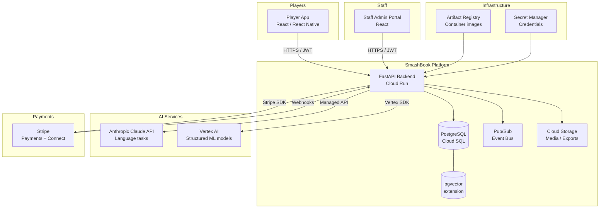
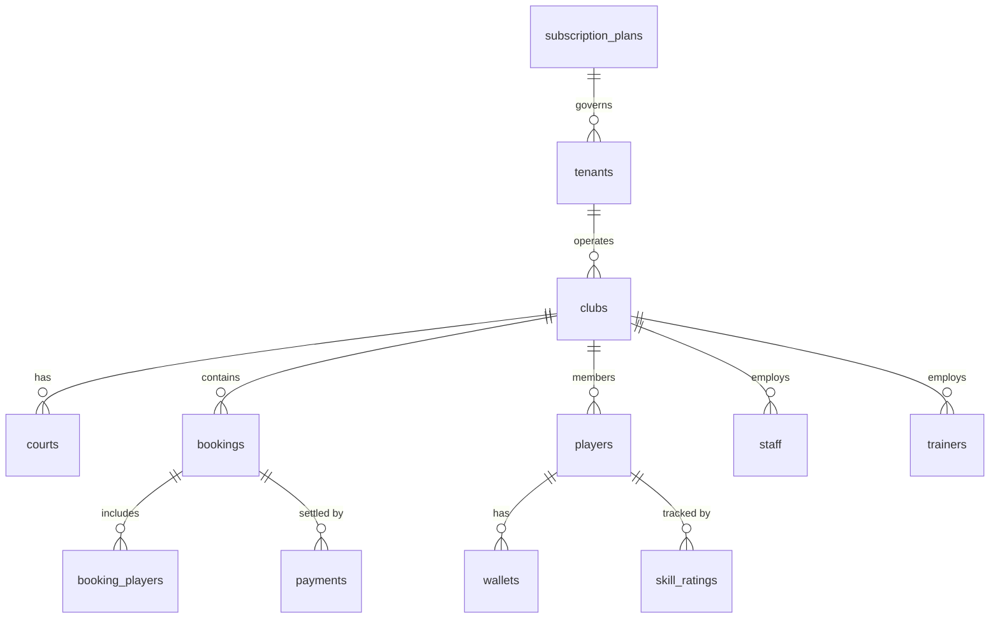

_Last updated: 2026-03-28 00:00 UTC_

# SmashBook — Architecture

> **Audience:** Engineering (current and future contributors), technical investors/partners  
> **Last updated:** 2026-03-28 (Service inventory added)  
> **Status:** MVP in progress (Sprints 1–6), AI phases follow

---

## Table of Contents

- [SmashBook — Architecture](#smashbook--architecture)
  - [Table of Contents](#table-of-contents)
  - [1. What SmashBook Is](#1-what-smashbook-is)
  - [2. System Context](#2-system-context)
  - [3. Multi-Tenant Design](#3-multi-tenant-design)
    - [Tenant hierarchy](#tenant-hierarchy)
    - [Tenant isolation pattern](#tenant-isolation-pattern)
    - [AI feature gating](#ai-feature-gating)
  - [4. Backend Architecture](#4-backend-architecture)
    - [Technology stack](#technology-stack)
    - [Project structure](#project-structure)
    - [Request flow](#request-flow)
  - [5. Data Model Overview](#5-data-model-overview)
    - [Core entities and relationships](#core-entities-and-relationships)
    - [Non-obvious relationships](#non-obvious-relationships)
  - [6. Payments \& Platform Fees](#6-payments--platform-fees)
    - [Stripe Connect architecture](#stripe-connect-architecture)
    - [Fee configuration](#fee-configuration)
    - [Webhook handling](#webhook-handling)
  - [7. AI Architecture](#7-ai-architecture)
    - [Service allocation](#service-allocation)
    - [The inference service wrapper](#the-inference-service-wrapper)
    - [Every AI call: the internal flow](#every-ai-call-the-internal-flow)
    - [Sync vs async split](#sync-vs-async-split)
    - [pgvector and RAG](#pgvector-and-rag)
    - [Core principles](#core-principles)
    - [All AI features by phase](#all-ai-features-by-phase)
    - [New AI-native service classes](#new-ai-native-service-classes)
    - [New Pub/Sub topics for AI pipeline](#new-pubsub-topics-for-ai-pipeline)
  - [8. Infrastructure \& Deployment](#8-infrastructure--deployment)
    - [Environments](#environments)
    - [GCP services used](#gcp-services-used)
    - [Local development](#local-development)
  - [9. Authentication \& Authorisation](#9-authentication--authorisation)
    - [JWT pattern](#jwt-pattern)
    - [Roles](#roles)
  - [10. Key Design Decisions (ADR Index)](#10-key-design-decisions-adr-index)
  - [11. Full Service Inventory](#11-full-service-inventory)

---

## 1. What SmashBook Is

SmashBook is a **multi-tenant SaaS platform for padel club management**. Padel clubs are the tenants. Each club gets its own isolated operational environment — courts, bookings, players, staff, trainers, payments — managed through a shared platform.

The long-term vision is **autonomous club operations**: a club with zero operational staff where bookings, payments, communications, pricing, and player engagement are entirely AI-driven. The platform is being built toward this in three phases:

| Phase | Scope | Timeline |
|-------|-------|----------|
| MVP (Sprints 1–6) | Core booking, payments, role-based access, Stripe integration | Months 1–3 |
| Phase 1 AI | Dynamic pricing, gap detection, smart notifications, revenue forecasting | Months 1–3 (post-MVP) |
| Phase 2 AI | Matchmaking, churn prediction, skill tracking, Fill the Court | Months 4–6 |
| Phase 3 AI | Conversational booking, AI support chatbot, CV court analysis | Months 7–12 |

---

## 2. System Context



**Key points:**
- All client traffic hits the FastAPI backend on Cloud Run; there is no direct database access from clients
- Stripe webhooks are the only inbound external call (payment events)
- AI services are called from the backend only — never from the frontend
- pgvector runs as a PostgreSQL extension on the same Cloud SQL instance (no separate vector DB)

---

## 3. Multi-Tenant Design

This is the most important architectural decision in the system. Understanding it is prerequisite to everything else.

### Tenant hierarchy

```
subscription_plans          ← entitlement + feature flag layer
    └── tenants             ← a business operating one or more clubs
            └── clubs       ← the physical padel facility (root of operations)
                    ├── courts
                    ├── bookings
                    ├── players (club-scoped memberships)
                    ├── staff
                    └── trainers
```

**`subscription_plans`** controls what a tenant can do:
- Court limits, booking type permissions, feature flags (e.g. `ai_dynamic_pricing`, `matchmaking_enabled`)
- This is the entitlement layer — no AI feature runs for a tenant unless their plan has the flag set

**`tenants`** represent the business entity (could own multiple clubs). Stripe billing is at tenant level.

**`clubs`** are the operational root. Almost all queries are scoped to a `club_id`. A player at Club A has no visibility into Club B even if they are the same person.

### Tenant isolation pattern

Every service class enforces club-scoping at query time:

```python
# Every data access method receives club_id from the authenticated context
def get_bookings(db: Session, club_id: UUID, filters: BookingFilters) -> list[Booking]:
    return db.query(Booking).filter(
        Booking.club_id == club_id,  # always scoped
        ...
    ).all()
```

There is no row-level security at the database level — isolation is enforced in the service layer. This is a deliberate trade-off (simpler schema, faster queries) with the consequence that service layer tests must include cross-tenant boundary assertions.

### AI feature gating

AI features are gated per-tenant via feature flags on `subscription_plans`:

```python
def requires_ai_feature(feature: str):
    def decorator(func):
        def wrapper(*args, club: Club, **kwargs):
            if not club.tenant.subscription_plan.features.get(feature):
                raise FeatureNotAvailableError(feature)
            return func(*args, club=club, **kwargs)
        return wrapper
    return decorator
```

---

## 4. Backend Architecture

### Technology stack

| Layer | Technology | Notes |
|-------|-----------|-------|
| API framework | FastAPI | Async, OpenAPI auto-generation |
| ORM | SQLAlchemy 2.x | Declarative models, async sessions |
| Migrations | Alembic | Version-controlled schema changes |
| Database | PostgreSQL (Cloud SQL) | + pgvector extension |
| Runtime | Cloud Run | Containerised, auto-scaling |
| Task / events | Pub/Sub | Async background jobs (notifications, AI triggers) |
| Storage | Cloud Storage | Receipts, exports, court media |
| Secrets | Secret Manager | All credentials, never in env files |

### Project structure

```
backend/
├── Dockerfile               # API image
├── Dockerfile.worker        # Worker image (CMD overridden per worker at deploy time)
├── alembic.ini              # Alembic migration config
├── requirements.txt
├── scripts/
│   └── seed_local.py        # Local dev seed data
├── tests/
│   └── unit/
└── app/
    ├── main.py              # FastAPI app factory
    ├── api/
    │   └── v1/
    │       ├── router.py    # Aggregates all endpoint routers
    │       ├── dependencies/
    │       │   ├── auth.py      # JWT auth dependency (current_user)
    │       │   └── tenant.py    # Tenant resolution dependency
    │       └── endpoints/       # One file per domain
    │           ├── auth.py
    │           ├── bookings.py
    │           ├── clubs.py
    │           ├── courts.py
    │           ├── payments.py
    │           ├── players.py
    │           ├── reports.py
    │           ├── staff.py
    │           ├── support.py
    │           └── trainers.py
    ├── core/
    │   ├── config.py        # Settings via pydantic-settings
    │   ├── context.py       # Request-scoped context (tenant, club)
    │   ├── pubsub.py        # Pub/Sub publisher client
    │   └── security.py      # JWT creation/validation, password hashing
    ├── db/
    │   ├── session.py       # Async SQLAlchemy engine + session factory
    │   ├── models/          # SQLAlchemy ORM models (11 files)
    │   │   ├── base.py          # Base, UUIDMixin, TimestampMixin
    │   │   ├── tenant.py
    │   │   ├── user.py
    │   │   ├── club.py
    │   │   ├── court.py
    │   │   ├── booking.py
    │   │   ├── payment.py
    │   │   ├── wallet.py
    │   │   ├── skill.py
    │   │   ├── staff.py
    │   │   └── equipment.py
    │   └── migrations/
    │       └── versions/    # Alembic migration files
    ├── middleware/
    │   └── tenant.py        # Resolves subdomain → Tenant on every request
    ├── schemas/             # Pydantic request/response schemas
    │   ├── user.py
    │   └── club.py
    ├── services/            # Business logic, one class per domain
    │   ├── booking_service.py
    │   ├── court_service.py
    │   ├── equipment_service.py
    │   ├── notification_service.py
    │   ├── payment_service.py
    │   ├── player_service.py
    │   ├── report_service.py
    │   ├── staff_service.py
    │   └── storage_service.py
    └── workers/             # Cloud Run worker entry points (Pub/Sub consumers)
        ├── booking_worker.py
        ├── payment_worker.py
        └── notification_worker.py

frontend-player/             # React player-facing app
frontend-staff/              # React staff admin portal
mobile/                      # React Native mobile app
infra/
├── setup/
│   └── gcp-setup.sh         # One-time GCP bootstrap script
└── terraform/               # IaC for all GCP resources
    ├── main.tf
    ├── variables.tf
    └── modules/
        ├── cloud-run/
        ├── cloud-sql/
        ├── networking/
        ├── pubsub/
        └── storage/
```

### Request flow

```
Client → FastAPI route → dependency injection (auth, db session)
       → service class (business logic, tenant scoping)
       → SQLAlchemy model (data access)
       → PostgreSQL
```

AI features are triggered either synchronously (e.g. pricing lookup at booking time) or asynchronously via Pub/Sub events (e.g. post-match skill rating update).

---

## 5. Data Model Overview

The full ER diagram is auto-generated and maintained at `docs/DATA_MODEL.md`.

### Core entities and relationships



### Non-obvious relationships

- **`booking_players`** is a junction table — a booking can have 1–4 players, each with their own payment status and attendance confirmation
- **`wallets`** hold pre-loaded credit at the player level — one wallet per user (global, not club-scoped)
- **`skill_ratings`** are club-scoped and updated post-match; staff can override, with all changes logged in `skill_rating_history`
- **`payments`** reference both a Stripe PaymentIntent and (optionally) a wallet debit, supporting hybrid payment (partial wallet + card)

---

## 6. Payments & Platform Fees

### Stripe Connect architecture

SmashBook uses **Stripe Connect** (platform model):

```
Player pays → SmashBook platform account
           → platform fee deducted (configured per subscription_plan)
           → remainder transferred to club's connected Stripe account
```

This means SmashBook earns a percentage of every transaction without clubs needing to manage platform billing separately.

### Fee configuration

Platform fee rates are stored on `subscription_plans` (`platform_fee_pct`). All fee transactions are written to a `platform_fees` ledger table for reconciliation.

### Webhook handling

Stripe sends events to `/webhooks/stripe`. Critical events handled:

| Event | Action |
|-------|--------|
| `payment_intent.succeeded` | Mark booking as paid, trigger confirmation |
| `payment_intent.payment_failed` | Flag booking as unpaid, notify staff |
| `charge.dispute.created` | Queue for manual review |
| `account.updated` | Sync connected account status |

Webhooks are verified using Stripe signature validation before any processing occurs.

---

## 7. AI Architecture

### Service allocation

Two external AI providers handle fundamentally different jobs. The decision rule: **if a human would write it, use Anthropic; if a model would score it, use Vertex AI.**

| Task type | Service | Examples |
|-----------|---------|---------|
| Language generation | Anthropic Claude API | Notification copy, insight summaries, re-engagement messages, conversational booking, support chatbot |
| Structured ML / prediction | Vertex AI | Demand forecasting, churn scoring, price multipliers, anomaly detection, skill rating models |
| Semantic search / RAG | pgvector on Cloud SQL | Player preference matching, matchmaking similarity, similar booking patterns |

### The inference service wrapper

Every AI call — regardless of provider or feature — goes through a single `ai_inference_service.py` wrapper. This class is the linchpin of the entire AI layer and handles four responsibilities:

1. **Feature flag check** — reads `ai_feature_flags` table; raises `FeatureNotAvailableError` if the feature is disabled for this tenant, returning the fallback result immediately without making an external API call.
2. **Input deduplication** — computes a SHA-256 hash of the input payload; skips the model call and returns a cached result if the same input was recently processed.
3. **Model call with retry** — calls the appropriate provider SDK with exponential backoff; catches all errors cleanly.
4. **Inference logging** — writes a row to `ai_inference_log` (input, output, token counts, latency, model version, `fallback_used` flag) before returning to the caller. The log write happens regardless of whether the call succeeded or fell back — you never lose a record.

```python
class AIInferenceService:
    async def call(
        self,
        feature: str,
        provider: ModelProvider,
        model: str,
        payload: dict,
        club: Club,
        fallback_fn: Callable,
    ) -> AIInferenceResult:
        # 1. Feature flag check
        if not await self._is_enabled(feature, club.tenant_id):
            return AIInferenceResult(output=await fallback_fn(), fallback_used=True)

        # 2. Input hash / cache check
        input_hash = hashlib.sha256(json.dumps(payload, sort_keys=True).encode()).hexdigest()
        if cached := await self._get_cached(input_hash):
            return cached

        # 3. Model call
        start = time.monotonic()
        try:
            output = await self._call_provider(provider, model, payload)
            fallback_used = False
        except Exception as e:
            output = await fallback_fn()
            fallback_used = True

        # 4. Log everything
        await self._log(feature, provider, model, payload, output,
                        input_hash, fallback_used, time.monotonic() - start, club)
        return AIInferenceResult(output=output, fallback_used=fallback_used)
```

### Every AI call: the internal flow

```
Feature service
    │
    ├─ ai_feature_flags check ──── disabled ──→ fallback result
    │                                                    │
    ▼                                                    │
AI inference service                                     │
    │                                                    │
    ├─ input hash check ────────── cache hit ──→ cached result
    │                                                    │
    ▼                                                    │
Model API call (Anthropic / Vertex AI)                   │
    │                                                    │
    ├─ error ───────────────────────────────→ fallback result ─┐
    │                                                           │
    ▼                                                           │
ai_inference_log write ◄─────────────────────────────────────┘
    │                         (fallback_used = true for errors)
    ▼
Result returned to feature service
    │
    ├──→ ai_recommendations
    ├──→ gap_detection_events
    ├──→ campaign trigger (Pub/Sub)
    ├──→ pricing_rules update
    └──→ notification send
```

### Sync vs async split

**Synchronous** (blocks the user request — must be fast):

- **Dynamic pricing** — called at booking time; must resolve before the price is shown to the player. Uses a Vertex AI structured endpoint, not a generative model, so latency is predictable.

**Asynchronous via Pub/Sub** (all other AI features):

- Churn scoring, gap detection, revenue forecasting — scheduled workers publish events; AI workers consume them without ever touching the request path.
- Notification drafting, re-engagement copy — triggered by gap or churn events; Anthropic API call happens in a worker.
- Post-match skill updates, segment re-classification — event-driven from booking completion.

The general rule: if the user is waiting for the response, the AI call must be synchronous and use the fastest available model. Everything else goes async.

### pgvector and RAG

pgvector runs as a PostgreSQL extension on the same Cloud SQL instance — no separate vector database. It is used in two contexts:

- **Matchmaking (Phase 2)** — player embeddings (skill level, availability patterns, play style) are stored as vectors. When an open game slot needs filling, a similarity query finds the best-fit players from the same club.
- **Conversational booking (Phase 3)** — booking history and player preferences are retrieved as context and injected into the Anthropic API prompt, enabling personalised responses without relying on the model's context window alone.

Embeddings are generated by Vertex AI's embedding models and written to the database by the scoring pipeline workers.

### Core principles

**1. Graceful degradation** — every AI feature has a non-AI fallback. If the pricing model is unavailable, the service returns the base rate from `pricing_rules`. If matchmaking fails, the booking proceeds without match suggestions. Fallback logic lives inside the feature service, not the inference wrapper, so each feature can define the most appropriate fallback independently.

**2. Logging from day one** — all AI inputs and outputs are logged to `ai_inference_log` before any feature goes to production. This table is the foundation for evaluation, debugging, cost tracking, and future model fine-tuning. Partition it by month in production; archive full payloads to Cloud Storage after 90 days and retain only metadata.

**3. Per-tenant feature gating** — no AI feature runs unless explicitly enabled on the tenant's `subscription_plan` (plan-level) and confirmed in `ai_feature_flags` (runtime override). The two-layer check allows plan-level defaults to be overridden per tenant without schema changes.

**4. Async where possible** — AI calls that do not need to block the user request are triggered via Pub/Sub. This keeps API response times fast and decouples AI pipeline failures from the core booking flow.

**5. Cost alignment** — AI features are gated per subscription plan and consumption is tracked via `ai_inference_log` (token counts per tenant). This supports per-plan AI pricing and makes overage billing straightforward.

### All AI features by phase

| Feature | Trigger | Provider | Output | Phase |
|---------|---------|----------|--------|-------|
| Dynamic pricing | Booking request (sync) | Vertex AI | Price multiplier | 1 |
| Gap detection | Hourly scheduler | Vertex AI | Gap event + discount offer | 1 |
| Smart notifications | Gap detected | Anthropic | Targeted push / SMS copy | 1 |
| AI insights dashboard | Dashboard load | Anthropic | Natural-language summary | 1 |
| Revenue forecasting | Daily scheduler | Vertex AI | Weekly/monthly projections | 1 |
| Weather-aware reminders | 6h before booking | Weather API + Anthropic | Personalised alert | 1 |
| Payment anomaly detection | Payment event | Vertex AI | Anomaly flag + staff alert | 1 |
| Membership tier suggestions | Wallet top-up | Vertex AI | Tier recommendation | 1 |
| Churn scoring | Daily scheduler | Vertex AI | Risk scores per player | 2 |
| Player segmentation | Post-scoring | Vertex AI | Segment assignments | 2 |
| Re-engagement campaigns | Churn threshold crossed | Anthropic | Campaign copy + audience | 2 |
| Matchmaking | Open game request | pgvector + Vertex AI | Player suggestions | 2 |
| Skill rating updates | Booking completion | Vertex AI | Skill delta | 2 |
| Fill the Court | Low utilisation | Vertex AI + Anthropic | Targeted offers + copy | 2 |
| Conversational booking | Player chat message | Anthropic (tool use) | Confirmed booking | 3 |
| AI support chatbot | Player support request | Anthropic (tool use) | Resolution / escalation | 3 |
| CV court analysis | Video upload | Vertex AI Vision | Rally stats, skill signals | 3 |

### New AI-native service classes

These service classes are added alongside the AI-native schema (see `docs/DATA_MODEL.md` — AI schema addendum):

| Service | Responsibilities |
|---------|-----------------|
| `ai_inference_service.py` | Centralised wrapper for all AI API calls; handles flag check, logging, fallback, retry |
| `segmentation_service.py` | Create/update segments, run AI classifier, manage segment memberships |
| `churn_service.py` | Score players, update `player_engagement_scores`, trigger re-engagement campaigns |
| `campaign_service.py` | Campaign CRUD, audience selection, send orchestration, conversion tracking |
| `utilisation_service.py` | Compute and store `court_utilisation_snapshots`, trigger gap detection pipeline |
| `gap_detection_service.py` | Detect gaps, generate discount offers, write `gap_detection_events`, trigger notifications |
| `ai_recommendation_service.py` | Create, route, and action recommendations; manage staff approval workflow |

### New Pub/Sub topics for AI pipeline

| Topic | Published by | Consumed by |
|-------|-------------|-------------|
| `utilisation-snapshots` | Scheduled worker (hourly) | `gap_detection_worker` |
| `gap-detected` | `gap_detection_service` | `campaign_worker`, `notification_worker` |
| `churn-scores-updated` | Scheduled worker (daily) | `campaign_worker` |
| `segment-assigned` | `segmentation_service` | `campaign_worker` |
| `recommendation-created` | `ai_recommendation_service` | `notification_worker` (staff alerts) |
| `campaign-triggered` | `campaign_service` | `notification_worker` |

---

## 8. Infrastructure & Deployment

### Environments

| Environment | Purpose | Deployment trigger |
|-------------|---------|-------------------|
| `dev` | Local development | Docker Compose |
| `staging` | Integration testing, pre-release validation | Push to `main` |
| `production` | Live platform | Manual promotion from staging |

See `docs/DEPLOYMENT.md` for the full CI/CD runbook.

### GCP services used

| Service | Purpose |
|---------|---------|
| Cloud Run | API hosting (containerised, auto-scaling) |
| Cloud SQL (PostgreSQL) | Primary database + pgvector |
| Cloud Storage | Receipts, exports, court media |
| Pub/Sub | Async event bus |
| Artifact Registry | Docker image storage |
| Secret Manager | All credentials and API keys |
| Vertex AI | Structured ML model hosting |

### Local development

```bash
# Start local environment
docker compose up

# Services available at:
# API:      http://localhost:8080
# Docs:     http://localhost:8080/api/v1/docs
# Database: localhost:5432
```

---

## 9. Authentication & Authorisation

### JWT pattern

SmashBook uses a dual-token pattern:

- **Access token** — short-lived (15 min), sent with every request
- **Refresh token** — longer-lived (7 days), used to obtain new access tokens

Both are JWTs signed with HS256. Tokens contain `user_id`, `club_id`, `role`, and `tenant_id` claims.

### Roles

| Role | Scope | Capabilities |
|------|-------|-------------|
| `player` | Club | Bookings, payments, own profile |
| `viewer` | Club | Read-only access to club data |
| `staff` | Club | All player capabilities + booking admin, player management |
| `trainer` | Club | Own schedule, assigned lesson bookings |
| `ops_lead` | Club | All staff capabilities + trainer schedule management |
| `admin` | Club | Full club configuration except ownership transfer |
| `owner` | Club | Full club configuration + billing |

Role is enforced via FastAPI dependencies:

```python
@router.get("/admin/bookings")
async def list_all_bookings(
    current_user: User = Depends(require_role("staff"))
):
    ...
```

---

## 10. Key Design Decisions (ADR Index)

Full ADR documents are in `docs/adr/`.

| # | Decision | Status |
|---|----------|--------|
| [ADR-001](adr/ADR-001-cloud-run.md) | Cloud Run over GKE for API hosting | Accepted |
| [ADR-002](adr/ADR-002-multitenant-shared-schema.md) | Shared schema multi-tenancy over schema-per-tenant | Accepted |
| [ADR-003](adr/ADR-003-stripe-connect.md) | Stripe Connect for platform fee splitting | Accepted |
| [ADR-004](adr/ADR-004-fastapi.md) | FastAPI over Django/Flask | Accepted |
| [ADR-005](adr/ADR-005-pgvector.md) | pgvector on Cloud SQL over dedicated vector DB | Accepted |
| [ADR-006](adr/ADR-006-service-layer-isolation.md) | Tenant isolation in service layer over RLS | Accepted |

---

## 11. Full Service Inventory

The table below lists every server, service, and external dependency that exists when the platform is fully deployed (post Sprint 13). Services marked **MVP** are live after Sprint 6; AI phase services come online in Sprints 7–13.

### Cloud Run Services (long-running)

| Service name | Image | Phase | Description |
|---|---|---|---|
| `padel-api` | `padel-api` | MVP | FastAPI backend. All client traffic (staff portal, player web app, mobile) hits this service. Handles bookings, auth, payments, courts, players, staff, Stripe webhooks. |
| `padel-booking-worker` | `padel-worker` | MVP | Pub/Sub consumer. Processes booking events asynchronously — confirmations, reminders, waitlist logic. |
| `padel-payment-worker` | `padel-worker` | MVP | Pub/Sub consumer. Handles payment processing events, Stripe webhook fanout, refund flows. |
| `padel-notification-worker` | `padel-worker` | MVP | Pub/Sub consumer. Dispatches push (Firebase), email (SendGrid), and SMS notifications. |
| `padel-gap-detection-worker` | `padel-worker` | AI Phase 1 | Consumes `utilisation-snapshots` topic (published hourly by Cloud Scheduler). Runs gap detection via Vertex AI, writes `gap_detection_events`, triggers discount offers. |
| `padel-campaign-worker` | `padel-worker` | AI Phase 1 | Consumes `gap-detected`, `churn-scores-updated`, and `segment-assigned` topics. Orchestrates campaign targeting and triggers notification sends. |
| `padel-churn-worker` | `padel-worker` | AI Phase 2 | Daily scheduled scoring run. Calls Vertex AI churn model, writes `player_engagement_scores`, publishes `churn-scores-updated`. |
| `padel-segmentation-worker` | `padel-worker` | AI Phase 2 | Consumes churn scores, runs player segment classification via Vertex AI, writes `player_segment_memberships`. |

All 8 services are deployed from just **2 Docker images** (`padel-api` and `padel-worker`) — the worker image `CMD` is overridden per service at deploy time via `gcloud run deploy`.

### Cloud Run Jobs (one-off / scheduled)

| Job name | Trigger | Phase | Description |
|---|---|---|---|
| `run-migrations` | CI/CD pipeline (every deploy) | MVP | Runs `alembic upgrade head` against Cloud SQL before the new service revision receives traffic. |
| `utilisation-snapshot-job` | Cloud Scheduler — hourly | AI Phase 1 | Computes `court_utilisation_snapshots` per court per hour. Publishes to the `utilisation-snapshots` Pub/Sub topic. |
| `revenue-forecast-job` | Cloud Scheduler — daily | AI Phase 1 | Reads utilisation and payment history, writes AI revenue forecasts via Vertex AI. |

### GCP Managed Services

| Service | Purpose |
|---|---|
| Cloud SQL (PostgreSQL 16) | Primary database + pgvector extension. One primary instance + one read replica. All ORM access goes through async SQLAlchemy sessions. |
| Artifact Registry | Docker image storage for `padel-api` and `padel-worker`, tagged by git SHA. Two images serve all 8 Cloud Run services. |
| Pub/Sub | Async event bus. See topic list below. |
| Cloud Storage | Booking receipts, exports, court media, and Terraform remote state. |
| Secret Manager | All credentials: database URLs, Stripe keys, SendGrid API key, Firebase credentials, JWT secret. Never in env files. |
| Cloud Scheduler | Triggers utilisation snapshot job (hourly) and churn scoring job (daily). |

### Pub/Sub Topics

| Topic | Published by | Consumed by | Phase |
|---|---|---|---|
| `booking-events` | `padel-api` | `padel-booking-worker` | MVP |
| `payment-events` | `padel-api` | `padel-payment-worker` | MVP |
| `notification-events` | `padel-api`, workers | `padel-notification-worker` | MVP |
| `utilisation-snapshots` | `utilisation-snapshot-job` | `padel-gap-detection-worker` | AI Phase 1 |
| `gap-detected` | `gap_detection_service` | `padel-campaign-worker`, `padel-notification-worker` | AI Phase 1 |
| `churn-scores-updated` | `padel-churn-worker` | `padel-campaign-worker` | AI Phase 2 |
| `segment-assigned` | `segmentation_service` | `padel-campaign-worker` | AI Phase 2 |
| `recommendation-created` | `ai_recommendation_service` | `padel-notification-worker` | AI Phase 2 |
| `campaign-triggered` | `campaign_service` | `padel-notification-worker` | AI Phase 2 |

### External APIs & Third-Party Services

| Service | Purpose | Phase |
|---|---|---|
| Stripe Connect | Payments and platform fee splitting. Stripe webhooks are the only inbound external calls to the platform. | MVP |
| Anthropic Claude API | Language tasks: notification copy generation, AI insights dashboard summaries, re-engagement campaign text, conversational booking (Phase 3), AI support chatbot (Phase 3). | AI Phase 1 |
| Vertex AI | Structured ML: dynamic pricing, gap detection, churn scoring, cancellation prediction, matchmaking, skill rating updates, CV court analysis (Phase 3). | AI Phase 1 |
| SendGrid (or Mailgun) | Transactional email delivery. | MVP |
| Firebase Cloud Messaging | Mobile push notifications to the React Native app. | MVP |

### Frontend Applications

| App | Tech | Phase | Notes |
|---|---|---|---|
| Staff Admin Portal | React (SPA) | MVP | Deployed as static assets. Connects to `padel-api` via typed OpenAPI client. |
| Player Web App | React (SPA) | MVP | Browser-based booking and account management. |
| Mobile App | React Native / Expo | Post-MVP | iOS and Android. Follows MVP go-live. |

### Summary

| Category | Count |
|---|---|
| Cloud Run Services | 8 |
| Cloud Run Jobs | 3 |
| GCP Managed Services | 6 |
| Pub/Sub Topics | 9 |
| External APIs / third-party | 5 |
| Frontend apps | 3 |
| **Total** | **34** |

---

*SmashBook — Architecture Document*  
*Maintained alongside the codebase in `docs/ARCHITECTURE.md`*