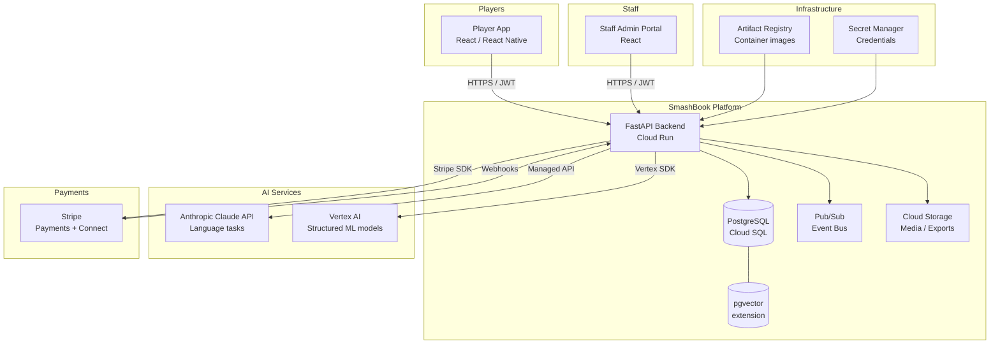
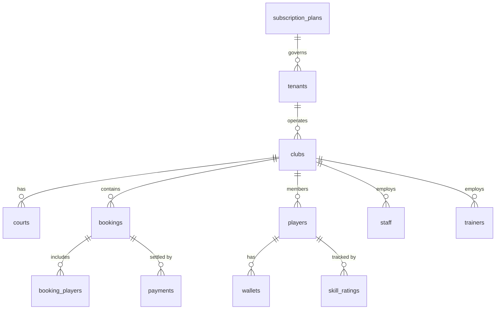

# SmashBook — Architecture

> **Audience:** Engineering (current and future contributors), technical investors/partners  
> **Last updated:** 2026-03  
> **Status:** MVP in progress (Sprints 1–6), AI phases follow

---

## Table of Contents

- [SmashBook — Architecture](#smashbook--architecture)
  - [Table of Contents](#table-of-contents)
  - [1. What SmashBook Is](#1-what-smashbook-is)
  - [2. System Context](#2-system-context)
  - [3. Multi-Tenant Design](#3-multi-tenant-design)
    - [Tenant hierarchy](#tenant-hierarchy)
    - [Tenant isolation pattern](#tenant-isolation-pattern)
    - [AI feature gating](#ai-feature-gating)
  - [4. Backend Architecture](#4-backend-architecture)
    - [Technology stack](#technology-stack)
    - [Project structure](#project-structure)
    - [Request flow](#request-flow)
  - [5. Data Model Overview](#5-data-model-overview)
    - [Core entities and relationships](#core-entities-and-relationships)
    - [Non-obvious relationships](#non-obvious-relationships)
  - [6. Payments \& Platform Fees](#6-payments--platform-fees)
    - [Stripe Connect architecture](#stripe-connect-architecture)
    - [Fee configuration](#fee-configuration)
    - [Webhook handling](#webhook-handling)
  - [7. AI Architecture](#7-ai-architecture)
    - [Service allocation](#service-allocation)
    - [Core principles](#core-principles)
    - [Phase 1 AI features (Quick Wins)](#phase-1-ai-features-quick-wins)
  - [8. Infrastructure \& Deployment](#8-infrastructure--deployment)
    - [Environments](#environments)
    - [GCP services used](#gcp-services-used)
    - [Local development](#local-development)
  - [9. Authentication \& Authorisation](#9-authentication--authorisation)
    - [JWT pattern](#jwt-pattern)
    - [Roles](#roles)
  - [10. Key Design Decisions (ADR Index)](#10-key-design-decisions-adr-index)

---

## 1. What SmashBook Is

SmashBook is a **multi-tenant SaaS platform for padel club management**. Padel clubs are the tenants. Each club gets its own isolated operational environment — courts, bookings, players, staff, trainers, payments — managed through a shared platform.

The long-term vision is **autonomous club operations**: a club with zero operational staff where bookings, payments, communications, pricing, and player engagement are entirely AI-driven. The platform is being built toward this in three phases:

| Phase | Scope | Timeline |
|-------|-------|----------|
| MVP (Sprints 1–6) | Core booking, payments, role-based access, Stripe integration | Months 1–3 |
| Phase 1 AI | Dynamic pricing, gap detection, smart notifications, revenue forecasting | Months 1–3 (post-MVP) |
| Phase 2 AI | Matchmaking, churn prediction, skill tracking, Fill the Court | Months 4–6 |
| Phase 3 AI | Conversational booking, AI support chatbot, CV court analysis | Months 7–12 |

---

## 2. System Context



**Key points:**
- All client traffic hits the FastAPI backend on Cloud Run; there is no direct database access from clients
- Stripe webhooks are the only inbound external call (payment events)
- AI services are called from the backend only — never from the frontend
- pgvector runs as a PostgreSQL extension on the same Cloud SQL instance (no separate vector DB)

---

## 3. Multi-Tenant Design

This is the most important architectural decision in the system. Understanding it is prerequisite to everything else.

### Tenant hierarchy

```
subscription_plans          ← entitlement + feature flag layer
    └── tenants             ← a business operating one or more clubs
            └── clubs       ← the physical padel facility (root of operations)
                    ├── courts
                    ├── bookings
                    ├── players (club-scoped memberships)
                    ├── staff
                    └── trainers
```

**`subscription_plans`** controls what a tenant can do:
- Court limits, booking type permissions, feature flags (e.g. `ai_dynamic_pricing`, `matchmaking_enabled`)
- This is the entitlement layer — no AI feature runs for a tenant unless their plan has the flag set

**`tenants`** represent the business entity (could own multiple clubs). Stripe billing is at tenant level.

**`clubs`** are the operational root. Almost all queries are scoped to a `club_id`. A player at Club A has no visibility into Club B even if they are the same person.

### Tenant isolation pattern

Every service class enforces club-scoping at query time:

```python
# Every data access method receives club_id from the authenticated context
def get_bookings(db: Session, club_id: UUID, filters: BookingFilters) -> list[Booking]:
    return db.query(Booking).filter(
        Booking.club_id == club_id,  # always scoped
        ...
    ).all()
```

There is no row-level security at the database level — isolation is enforced in the service layer. This is a deliberate trade-off (simpler schema, faster queries) with the consequence that service layer tests must include cross-tenant boundary assertions.

### AI feature gating

AI features are gated per-tenant via feature flags on `subscription_plans`:

```python
def requires_ai_feature(feature: str):
    def decorator(func):
        def wrapper(*args, club: Club, **kwargs):
            if not club.tenant.subscription_plan.features.get(feature):
                raise FeatureNotAvailableError(feature)
            return func(*args, club=club, **kwargs)
        return wrapper
    return decorator
```

---

## 4. Backend Architecture

### Technology stack

| Layer | Technology | Notes |
|-------|-----------|-------|
| API framework | FastAPI | Async, OpenAPI auto-generation |
| ORM | SQLAlchemy 2.x | Declarative models, async sessions |
| Migrations | Alembic | Version-controlled schema changes |
| Database | PostgreSQL (Cloud SQL) | + pgvector extension |
| Runtime | Cloud Run | Containerised, auto-scaling |
| Task / events | Pub/Sub | Async background jobs (notifications, AI triggers) |
| Storage | Cloud Storage | Receipts, exports, court media |
| Secrets | Secret Manager | All credentials, never in env files |

### Project structure

```
backend/
├── Dockerfile               # API image
├── Dockerfile.worker        # Worker image (CMD overridden per worker at deploy time)
├── alembic.ini              # Alembic migration config
├── requirements.txt
├── scripts/
│   └── seed_local.py        # Local dev seed data
├── tests/
│   └── unit/
└── app/
    ├── main.py              # FastAPI app factory
    ├── api/
    │   └── v1/
    │       ├── router.py    # Aggregates all endpoint routers
    │       ├── dependencies/
    │       │   ├── auth.py      # JWT auth dependency (current_user)
    │       │   └── tenant.py    # Tenant resolution dependency
    │       └── endpoints/       # One file per domain
    │           ├── auth.py
    │           ├── bookings.py
    │           ├── clubs.py
    │           ├── courts.py
    │           ├── payments.py
    │           ├── players.py
    │           ├── reports.py
    │           ├── staff.py
    │           ├── support.py
    │           └── trainers.py
    ├── core/
    │   ├── config.py        # Settings via pydantic-settings
    │   ├── context.py       # Request-scoped context (tenant, club)
    │   ├── pubsub.py        # Pub/Sub publisher client
    │   └── security.py      # JWT creation/validation, password hashing
    ├── db/
    │   ├── session.py       # Async SQLAlchemy engine + session factory
    │   ├── models/          # SQLAlchemy ORM models (11 files)
    │   │   ├── base.py          # Base, UUIDMixin, TimestampMixin
    │   │   ├── tenant.py
    │   │   ├── user.py
    │   │   ├── club.py
    │   │   ├── court.py
    │   │   ├── booking.py
    │   │   ├── payment.py
    │   │   ├── wallet.py
    │   │   ├── skill.py
    │   │   ├── staff.py
    │   │   └── equipment.py
    │   └── migrations/
    │       └── versions/    # Alembic migration files
    ├── middleware/
    │   └── tenant.py        # Resolves subdomain → Tenant on every request
    ├── schemas/             # Pydantic request/response schemas
    │   ├── user.py
    │   └── club.py
    ├── services/            # Business logic, one class per domain
    │   ├── booking_service.py
    │   ├── court_service.py
    │   ├── equipment_service.py
    │   ├── notification_service.py
    │   ├── payment_service.py
    │   ├── player_service.py
    │   ├── report_service.py
    │   ├── staff_service.py
    │   └── storage_service.py
    └── workers/             # Cloud Run worker entry points (Pub/Sub consumers)
        ├── booking_worker.py
        ├── payment_worker.py
        └── notification_worker.py

frontend-player/             # React player-facing app
frontend-staff/              # React staff admin portal
mobile/                      # React Native mobile app
infra/
├── setup/
│   └── gcp-setup.sh         # One-time GCP bootstrap script
└── terraform/               # IaC for all GCP resources
    ├── main.tf
    ├── variables.tf
    └── modules/
        ├── cloud-run/
        ├── cloud-sql/
        ├── networking/
        ├── pubsub/
        └── storage/
```

### Request flow

```
Client → FastAPI route → dependency injection (auth, db session)
       → service class (business logic, tenant scoping)
       → SQLAlchemy model (data access)
       → PostgreSQL
```

AI features are triggered either synchronously (e.g. pricing lookup at booking time) or asynchronously via Pub/Sub events (e.g. post-match skill rating update).

---

## 5. Data Model Overview

The full ER diagram is auto-generated and maintained at `docs/DATA_MODEL.md`.

### Core entities and relationships



### Non-obvious relationships

- **`booking_players`** is a junction table — a booking can have 1–4 players, each with their own payment status and attendance confirmation
- **`wallets`** hold pre-loaded credit at the player level, scoped to a club (a player's wallet at Club A is separate from Club B)
- **`skill_ratings`** are club-scoped and updated post-match; staff can override, with all changes logged in `skill_rating_history`
- **`payments`** reference both a Stripe PaymentIntent and (optionally) a wallet debit, supporting hybrid payment (partial wallet + card)

---

## 6. Payments & Platform Fees

### Stripe Connect architecture

SmashBook uses **Stripe Connect** (platform model):

```
Player pays → SmashBook platform account
           → platform fee deducted (configured per subscription_plan)
           → remainder transferred to club's connected Stripe account
```

This means SmashBook earns a percentage of every transaction without clubs needing to manage platform billing separately.

### Fee configuration

Platform fee rates are stored on `subscription_plans` (`platform_fee_pct`). All fee transactions are written to a `platform_fees` ledger table for reconciliation.

### Webhook handling

Stripe sends events to `/webhooks/stripe`. Critical events handled:

| Event | Action |
|-------|--------|
| `payment_intent.succeeded` | Mark booking as paid, trigger confirmation |
| `payment_intent.payment_failed` | Flag booking as unpaid, notify staff |
| `charge.dispute.created` | Queue for manual review |
| `account.updated` | Sync connected account status |

Webhooks are verified using Stripe signature validation before any processing occurs.

---

## 7. AI Architecture

### Service allocation

| Task type | Service | Examples |
|-----------|---------|---------|
| Language generation | Anthropic Claude API | Insights summaries, re-engagement messages, conversational booking, support chatbot |
| Structured ML | Vertex AI | Demand forecasting, churn prediction, cancellation prediction, skill rating models |
| Semantic search / RAG | pgvector on Cloud SQL | Player preference matching, similar booking patterns |

### Core principles

**1. Graceful degradation** — every AI feature has a non-AI fallback. If the pricing model is unavailable, the system falls back to base rates. If matchmaking fails, the booking proceeds without match suggestions.

**2. Logging from day one** — all AI inputs and outputs are logged to an `ai_inference_log` table before any feature is used in production. This supports evaluation, debugging, and future model fine-tuning.

**3. Per-tenant feature gating** — no AI feature runs unless explicitly enabled on the tenant's `subscription_plan`. This allows controlled rollout and per-plan pricing of AI capabilities.

**4. Async where possible** — AI calls that don't need to block the user request (post-match skill updates, churn scoring, re-engagement drafts) are triggered via Pub/Sub, keeping API response times fast.

### Phase 1 AI features (Quick Wins)

| Feature | Trigger | Service | Output |
|---------|---------|---------|--------|
| Dynamic pricing | Booking request | Vertex AI | Price multiplier |
| Gap detection & discounts | Scheduled (hourly) | Vertex AI | Discount offers pushed to eligible players |
| AI insights dashboard | Dashboard load | Anthropic API | Natural-language summary |
| Revenue forecasting | Scheduled (daily) | Vertex AI | Weekly/monthly projections |
| Smart notifications | Gap detected | Anthropic API | Targeted push copy |
| Weather-aware reminders | Scheduled (6h before booking) | Weather API + Anthropic | Alert message |
| Payment anomaly detection | Payment event | Vertex AI | Anomaly flag |
| Membership tier suggestions | Wallet top-up | Vertex AI | Tier recommendation |

---

## 8. Infrastructure & Deployment

### Environments

| Environment | Purpose | Deployment trigger |
|-------------|---------|-------------------|
| `dev` | Local development | Docker Compose |
| `staging` | Integration testing, pre-release validation | Push to `main` |
| `production` | Live platform | Manual promotion from staging |

See `docs/DEPLOYMENT.md` for the full CI/CD runbook.

### GCP services used

| Service | Purpose |
|---------|---------|
| Cloud Run | API hosting (containerised, auto-scaling) |
| Cloud SQL (PostgreSQL) | Primary database + pgvector |
| Cloud Storage | Receipts, exports, court media |
| Pub/Sub | Async event bus |
| Artifact Registry | Docker image storage |
| Secret Manager | All credentials and API keys |
| Vertex AI | Structured ML model hosting |

### Local development

```bash
# Start local environment
docker compose up

# Services available at:
# API:      http://localhost:8000
# Docs:     http://localhost:8000/docs
# Database: localhost:5432
```

---

## 9. Authentication & Authorisation

### JWT pattern

SmashBook uses a dual-token pattern:

- **Access token** — short-lived (15 min), sent with every request
- **Refresh token** — longer-lived (7 days), used to obtain new access tokens

Both are JWTs signed with HS256. Tokens contain `user_id`, `club_id`, `role`, and `tenant_id` claims.

### Roles

| Role | Scope | Capabilities |
|------|-------|-------------|
| `player` | Club | Bookings, payments, own profile |
| `staff` | Club | All player capabilities + booking admin, player management |
| `trainer` | Club | Own schedule, assigned lesson bookings |
| `operations_lead` | Club | All staff capabilities + trainer schedule management |
| `club_owner` | Club | Full club configuration |
| `platform_admin` | Platform | Cross-tenant administration |

Role is enforced via FastAPI dependencies:

```python
@router.get("/admin/bookings")
async def list_all_bookings(
    current_user: User = Depends(require_role("staff"))
):
    ...
```

---

## 10. Key Design Decisions (ADR Index)

Full ADR documents are in `docs/adr/`.

| # | Decision | Status |
|---|----------|--------|
| [ADR-001](adr/ADR-001-cloud-run.md) | Cloud Run over GKE for API hosting | Accepted |
| [ADR-002](adr/ADR-002-multitenant-shared-schema.md) | Shared schema multi-tenancy over schema-per-tenant | Accepted |
| [ADR-003](adr/ADR-003-stripe-connect.md) | Stripe Connect for platform fee splitting | Accepted |
| [ADR-004](adr/ADR-004-fastapi.md) | FastAPI over Django/Flask | Accepted |
| [ADR-005](adr/ADR-005-pgvector.md) | pgvector on Cloud SQL over dedicated vector DB | Accepted |
| [ADR-006](adr/ADR-006-service-layer-isolation.md) | Tenant isolation in service layer over RLS | Accepted |

---

*SmashBook — Architecture Document*  
*Maintained alongside the codebase in `docs/ARCHITECTURE.md`*