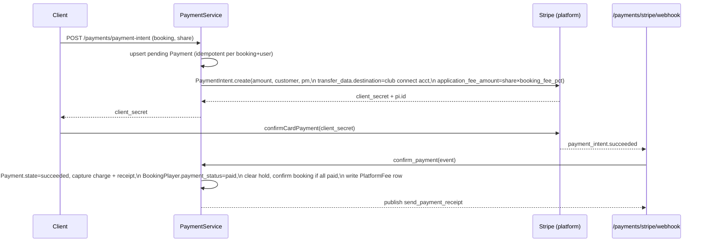
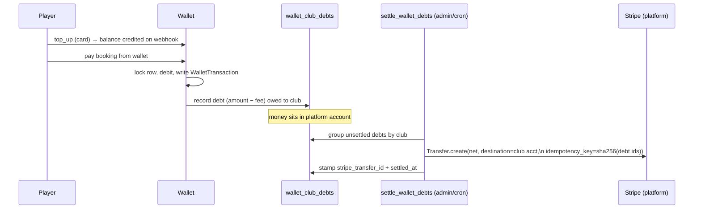

_Last updated: 2026-06-04 11:48 UTC_

# Payment Flow Strategy

This document is the authoritative reference for **how money moves through SmashBook** — the three payment rails, the Stripe account model, the lifecycle of a payment from intent to payout, and the strategic decisions still open. It complements rather than restates:

- [ARCHITECTURE.md §6 (Payments & Platform Fees)](ARCHITECTURE.md#6-payments--platform-fees) — Connect topology and the two-client model at a glance.
- [runbooks/STRIPE_BILLING_ACCOUNT_SPLIT.md](runbooks/STRIPE_BILLING_ACCOUNT_SPLIT.md) — the secrets/dashboard procedure for splitting the billing account.
- [app/ai/docs/PROVIDER_ROUTING.md](../backend/app/ai/docs/PROVIDER_ROUTING.md) — provider routing for the payment-related AI features (anomaly detection, dispute auto-flag).

Where this doc describes behaviour that is **not yet built**, it is marked **(planned)**. Everything unmarked reflects code in `backend/app/services/payment_service.py`, `backend/app/api/v1/endpoints/payments.py`, `backend/app/api/v1/endpoints/webhooks.py`, and `backend/app/core/stripe_clients.py` as of the timestamp above.

---

## 1. The three money rails

SmashBook moves money along three independent rails. Conflating them is the most common source of payment bugs, so they are kept strictly separate at the client, secret, and webhook level.

| # | Rail | Direction | Stripe model | Service | Webhook endpoint |
|---|------|-----------|--------------|---------|------------------|
| 1 | **Booking payments** | Player → Club | Connect destination charge + application fee | `PaymentService` | `POST /payments/stripe/webhook` |
| 2 | **Player memberships** | Player → Club | Connect subscription on the platform account | `MembershipService` | `POST /payments/stripe/webhook` |
| 3 | **Tenant SaaS billing** | Tenant (club operator) → SmashBook | Subscription on the SmashBook Corporate account | `StripeBillingService` | `POST /webhooks/stripe-billing` |

Rails 1 and 2 are **Connect** flows on the *platform* account (`STRIPE_SECRET_KEY`): the player pays, the club's connected account receives the money, SmashBook skims an application fee. Rail 3 is the opposite direction entirely — the *tenant* pays SmashBook for the right to use the platform — and runs on a separate account identity (`STRIPE_BILLING_SECRET_KEY`).

> **Why this matters:** A refund on rail 1 reverses a player charge and a Connect transfer. A failed invoice on rail 3 suspends a tenant's whole subscription. They share the word "subscription" and the words "invoice.payment_succeeded", but they are different accounts, different webhooks, and different blast radii. Never let a handler for one rail mutate state belonging to another.

---

## 2. The two Stripe account identities

Defined in [stripe_clients.py](../backend/app/core/stripe_clients.py) as two `lru_cache`'d `StripeClient` factories:

| Factory | Secret | Account role | Rails | Webhook secret(s) |
|---|---|---|---|---|
| `platform_client()` | `STRIPE_SECRET_KEY` | Connect platform — onboards connected accounts, charges players, deducts application fees, settles payouts | 1, 2 | `STRIPE_WEBHOOK_SECRET`, `STRIPE_CONNECT_WEBHOOK_SECRET` |
| `billing_client()` | `STRIPE_BILLING_SECRET_KEY` | SmashBook Corporate — tenant SaaS subscriptions | 3 | `STRIPE_BILLING_WEBHOOK_SECRET` |

API version is pinned via `STRIPE_API_VERSION` (`2024-12-18.acacia`).

Today `STRIPE_BILLING_SECRET_KEY` may point at the *same* Stripe account as `STRIPE_SECRET_KEY`. That is intentional — the split into a dedicated SmashBook Corporate account is a pure secrets/dashboard change requiring **no code edits**, because the two client factories already isolate the account identities. See [STRIPE_BILLING_ACCOUNT_SPLIT.md](runbooks/STRIPE_BILLING_ACCOUNT_SPLIT.md).

> **⚠️ Known strategic gap — legacy global on rail 1.** `PaymentService` does *not* yet use `platform_client()`. It still sets the module-level `stripe.api_key = settings.STRIPE_SECRET_KEY` global at import time and calls `stripe.PaymentIntent.create(...)` etc. directly. The two-client model is fully wired for `StripeBillingService` (rail 3) but only **partially adopted** for rails 1–2. This works today only *because* the two secrets currently point at the same account. **Before the corporate account split, `PaymentService` and `MembershipService` must be migrated onto `platform_client()`** — otherwise rails 1–2 would silently start talking to the corporate account. This migration is tracked as a precondition in the account-split runbook. Critically: never reintroduce the `stripe.api_key = ...` global into `stripe_billing_service.py`; that would force both accounts to share state.

---

## 3. Booking payment flow (rail 1)

### 3.1 Payment methods and states

`Payment.payment_method` (enum `PaymentMethod`): `stripe_card`, `wallet`, `cash`, `account_credit`.

`Payment.state` (enum `PaymentState`): `pending → succeeded → {refunded | partially_refunded}`, or `pending → failed`.

A `Payment` row also carries Stripe linkage (`stripe_payment_intent_id`, `stripe_charge_id`, `stripe_destination_payment_id`, `stripe_payout_id`, `stripe_receipt_url`), failure/retry fields (`failure_reason`, `retry_count`, `next_retry_at`), and AI/dispute fields (`anomaly_flagged`, `anomaly_reason`, `dispute_status`).

### 3.2 Split payments

A booking has 1–4 `booking_players`, each with its own `amount_due` and `payment_status`. **One `Payment` row is created per player share** — `create_payment_intent(booking_id, user_id, amount_pence, ...)` charges a single player's slice. The booking is only confirmed once `should_confirm(booking, all_players)` is satisfied (all slots filled and every accepted player paid). This is the "hybrid / split" model: different players in the same booking may pay by different methods (one by card, one from wallet).

### 3.3 Card flow — happy path

Key behaviours in `create_payment_intent` / `confirm_payment`:

- **Idempotent intent creation:** an existing `pending` Payment for the same booking+user is reused rather than duplicated.
- **Connect destination charge:** if the club has a `stripe_connect_account_id`, the PI is created with `transfer_data.destination` set to it, and `application_fee_amount = share × plan.booking_fee_pct` is skimmed to SmashBook.
- **Metadata routing:** every PI carries `booking_id`, `user_id`, `tenant_id`, `payment_id` (and `purpose` for wallet top-ups) so the webhook can route without DB guesswork.
- **Fee freezing:** the platform fee is recomputed and persisted as a `PlatformFee` row (`fee_type=booking_fee`) at confirm time using the plan's `booking_fee_pct` *as it stood at the transaction* — `pct_applied` is stored alongside `amount` so historical fees are auditable even after the plan changes.
- **Destination-payment capture:** at confirm time the code walks Charge → Transfer to record `stripe_destination_payment_id` (`py_xxx`), which payout reconciliation later matches against (see §6).

### 3.4 Card flow — failure

`handle_payment_failed` (on `payment_intent.payment_failed`):

1. `Payment.state = failed`, store `failure_reason` from `last_payment_error.message`, increment `retry_count`.
2. **Free the held slot immediately** via `_free_player_slot` — a failed card attempt must not keep blocking the court. If this leaves the booking with no paid player (organiser-never-paid case), the booking is cancelled.
3. Publish `payment_failed_player` (prompt retry) and `payment_failed_staff` (alert unpaid share) notification events.

---

## 4. Wallet flow

Wallets hold **pre-loaded player credit, one per user, global (not club-scoped)** — `Wallet.user_id` is unique. Balance is `Numeric(10,2)`, currency defaults `GBP`. Auto-top-up fields exist (`auto_topup_enabled`, `auto_topup_threshold`, `auto_topup_amount`) for a **(planned)** threshold-triggered top-up.

`WalletTransaction.transaction_type`: `top_up`, `debit`, `refund`, `adjustment`. Every transaction stamps `balance_after` (running ledger) and optionally `source_type` (`booking`, `membership`, `invoice`, `manual`) + `source_id`.

### 4.1 Top-up

`top_up_wallet` creates a card PaymentIntent with `metadata.purpose = "wallet_top_up"`. The wallet is **credited only when the webhook confirms** — `confirm_payment` detects the `wallet_top_up` purpose and dispatches to `_handle_wallet_top_up_succeeded`, never crediting optimistically. Minimum top-up is £1.00 (100 pence).

### 4.2 Spend (deduct) and the club-debt model

This is the most non-obvious part of the payment system. When a player pays for a booking **from wallet**, the money is already in SmashBook's platform account (it was collected at top-up time) — it has *not* reached the club. So `deduct_wallet`:

1. Locks the wallet row `FOR UPDATE` so concurrent debits serialise and the balance cannot go negative under contention; raises `402` on insufficient balance.
2. Decrements the balance and writes a `debit` `WalletTransaction`.
3. Writes a **`WalletClubDebt`** row — "the platform owes this club `amount − platform_fee_amount`, not yet transferred." The platform fee is computed from the plan's `booking_fee_pct` and stored on the debt.
4. For `source_type=booking`: also writes a `succeeded` `Payment` (method `wallet`), a `PlatformFee` row, marks the `BookingPlayer` paid, clears the hold, confirms the booking if complete, and publishes the receipt.

### 4.3 Debt settlement

`settle_wallet_debts` (triggered by `POST /payments/wallet/settle-debts`, admin-only; intended to run on a schedule) groups all unsettled `WalletClubDebt` rows by club, issues **one Stripe Transfer per club** for the net (amount − fees), and stamps `stripe_transfer_id` + `settled_at`. Safeguards:

- **Deterministic idempotency key** = `"settle-" + sha256(sorted debt ids)`. If a prior run created the Stripe transfer but the DB commit rolled back, Stripe returns the cached transfer instead of paying twice.
- Clubs without a `stripe_connect_account_id` are **skipped** (counted, logged) — their debts remain unsettled until onboarding completes.
- Net ≤ 0 batches are skipped.

### 4.4 Superseding a card flow with wallet

`supersede_pending_stripe_payment` cancels an in-flight card PaymentIntent before an alternative (wallet) payment, marking the Payment `failed` with reason "Superseded by wallet payment". If Stripe reports the PI already `succeeded`, it raises `409` rather than risk a double charge.

---

## 5. Refunds & disputes

### 5.1 Refunds — **(planned)**

`issue_refund(booking_id, user_id, ...)` is currently a stub (`pass`). The designed contract:

- **Card payment** → Stripe refund (full or partial), reversing the Connect transfer share.
- **Wallet payment** → credit the wallet back via a `refund` `WalletTransaction` (no Stripe round-trip).
- Set `Payment.state = refunded | partially_refunded` and `BookingPlayer.payment_status = refunded`.
- Generate a refund PDF (`pdf_storage_path`) and publish a refund-confirmation notification.

**Open decisions for refunds:**
- **Partial-refund accounting:** does a partial refund reverse the application fee proportionally, or does SmashBook keep the full booking fee? (Stripe's default reverses the fee pro-rata only if `refund_application_fee=true`.)
- **Wallet-funded refunds and club debt:** a wallet-paid booking already generated a `WalletClubDebt`. Refunding to the wallet must reverse or net-off the corresponding debt if it has not yet settled, and claw back via a negative transfer / debit if it has. This reconciliation must be designed before `issue_refund` ships.

### 5.2 Disputes

`Payment.dispute_status` (enum `DisputeStatus`): `open`, `under_review`, `won`, `lost`. Chargeback webhook handling (`charge.dispute.*`) to populate this field is **(planned)**. See §7 for the AI auto-flag that feeds `under_review` triage.

---

## 6. Payouts & reconciliation

Connect destination charges settle to the club's connected account, which Stripe pays out on its own schedule. `handle_payout_paid` (on `payout.paid`, a **Connect** event where `event["account"]` is the connected account):

- Lists the payout's balance transactions of `type="payment"` on the connected account.
- Each such transaction's `source` is the **destination payment id** (`py_xxx`) — not the platform-side charge (`ch_xxx`). This is why `confirm_payment` pre-captures `stripe_destination_payment_id`: it lets reconciliation match payments to a payout **without extra API calls**.
- Stamps `stripe_payout_id` onto every matched `Payment`.
- Raises `stripe.StripeError` on API failure so the webhook returns 5xx and Stripe auto-retries.

`reconcile_stripe_payouts(club_id)` (pull-based backfill from the Stripe API) is a stub (`pass`) — **(planned)** as a belt-and-braces complement to the push webhook.

---

## 7. AI touchpoints

Two payment features run through `ai_inference_service` (see [PROVIDER_ROUTING.md](../backend/app/ai/docs/PROVIDER_ROUTING.md)). Routing is owned by that doc; not restated here.

| Feature | Group | Provider | Sync | Touch on payment | Fallback |
|---|---|---|---|---|---|
| Payment anomaly detection | G8 | Vertex AI | async | sets `Payment.anomaly_flagged` / `anomaly_reason` for manual review | skip auto-action, surface manual review item |
| Payment dispute auto-flag | G11 | Vertex AI | async | pre-triages likely chargebacks toward `dispute_status` | manual review |

Neither blocks a payment. The only **synchronous** AI call in the whole platform is dynamic pricing, which influences the *amount* of a booking before `create_payment_intent` is called but is not itself part of the payment rail — it lives in the booking flow.

---

## 8. Failure, retry & idempotency strategy

| Mechanism | Where | Guarantee |
|---|---|---|
| Idempotent PI creation | `create_payment_intent` | reuses pending Payment per booking+user — no duplicate intents |
| Webhook re-delivery safety | `confirm_payment`, `handle_payment_failed` | early-returns if Payment already in the terminal state |
| Row-level lock | `deduct_wallet` | `SELECT … FOR UPDATE` serialises concurrent wallet debits |
| Transfer idempotency key | `settle_wallet_debts` | sha256(debt ids) → Stripe dedupes partial-failure retries |
| Stripe-driven retry | `handle_payout_paid` | re-raises on error so Stripe retries the webhook |
| Dual webhook signature | `/payments/stripe/webhook` | tries both platform + Connect secrets; `event["account"]` distinguishes |
| Async retry scheduling | `Payment.retry_count` / `next_retry_at` | fields exist; the retry **worker loop is (planned)** in `payment_worker.py` |

`release_expired_holds` sweeps unpaid held slots on a schedule, freeing courts whose payment deadline lapsed.

---

## 9. Stubs vs. implemented (current strategy status)

| Method / endpoint | Status |
|---|---|
| `create_payment_intent`, `confirm_payment`, `handle_payment_failed` | ✅ implemented |
| `top_up_wallet`, `deduct_wallet`, `settle_wallet_debts`, `supersede_pending_stripe_payment` | ✅ implemented |
| `handle_payout_paid`, `release_expired_holds` | ✅ implemented |
| Rail 3 billing webhooks (`/webhooks/stripe-billing`) | ✅ implemented |
| `issue_refund` | ⛔ stub — see §5.1 |
| `reconcile_stripe_payouts` | ⛔ stub — see §6 |
| `adjust_wallet`, `apply_discount`, `get_revenue_summary` | ⛔ stub |
| `process_in_person_payment` (cash), invoice list/download | ⛔ stub |
| Dispute webhook (`charge.dispute.*`) handling | ⛔ not wired |
| Auto-top-up (threshold-triggered) | ⛔ fields exist, logic (planned) |
| `PaymentService`/`MembershipService` on `platform_client()` | ⚠️ not migrated — legacy `stripe.api_key` global (see §2) |

> Keep this table in sync with the code. When a stub becomes real, also move its endpoint in [IMPLEMENTED_API.md](IMPLEMENTED_API.md) and update §3–§6 above.

---

## 10. Open strategic decisions

1. **Corporate account split (rail 3).** Precondition: migrate rails 1–2 off the `stripe.api_key` global onto `platform_client()` (§2). Until then the split is unsafe even though the runbook calls it "secrets-only."
2. **Refund accounting model** (§5.1) — application-fee reversal policy and wallet-debt clawback.
3. **Multi-currency.** `currency` columns exist on `Payment`, `Wallet`, `Club` and default `GBP`, but fee math, top-up minimums (hard-coded £1), and cross-currency wallet spend are single-currency today. A real multi-currency strategy is unscoped.
4. **Cash / in-person payments** (`process_in_person_payment`) — how staff-collected cash reconciles against Connect payouts and platform fees is undesigned.
5. **Auto-top-up** — trigger point, the card used when no `default_payment_method_id` is set, and failure handling.

---

_When any payment behaviour changes, update this doc alongside the code, and bump the timestamp on line 1 (per the Documentation Standards in [CLAUDE.md](../CLAUDE.md))._
